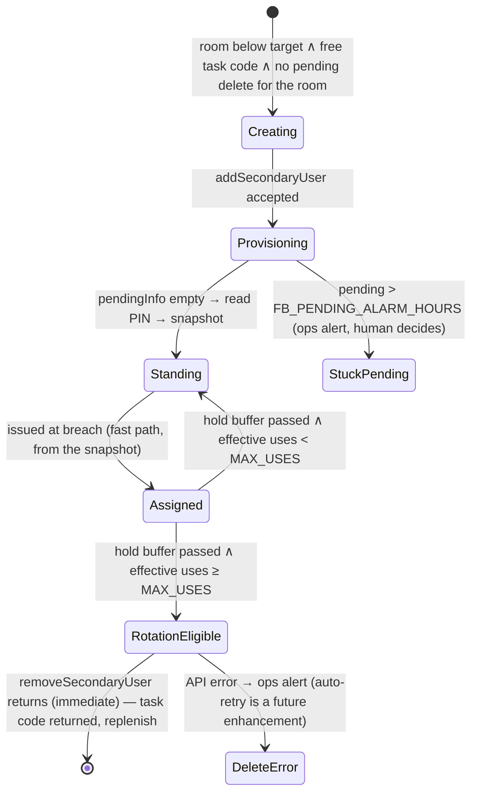

# lock-link — delivery leg (guest-facing)

The **delivery leg** of lock-link (system overview in [architecture.md](./architecture.md))
takes over guest communication: it sends each guest their door codes through **Lodgify's
messaging API**, holds the message until provisioning has actually succeeded, and — when
provisioning fails outright against the deadline — issues a pre-provisioned **fallback code**
from a warm per-room pool so the guest is never left standing outside. Owning the message
(rather than letting Lodgify's "X days before arrival" templates deliver a code field) is what
makes both behaviors possible: carrying a **different code per lock** on one reservation, and
**gating delivery on readiness** — a template fires on schedule even when the code isn't ready,
worst on last-minute bookings where "1 day before" means "immediately".

This leg builds on the [monitoring leg](./architecture-monitoring.md) and changes nothing
beneath it: capture, the timing model, readiness, the `key_code` convention, the evidence
store, and the notification plumbing are all defined there and used as-is. This document covers
only what the delivery leg **adds**: the message step, the fallback-code pool and its
reconciler, and the delivery-era alerting rules.

## Drift needing reconcile

This document carries content drafted before the monitoring leg's design settled. The
following conflicts are **known and deliberately unreconciled** — each needs a decision before
the delivery leg is implemented:

1. **Alert dedup mechanism.** Text below inherits the stateless one-shot model (threshold
   crossing on the tick grid, explicitly "no alert ledger"). The monitoring leg since
   introduced a DynamoDB **alert ledger** (riding the evidence store) as the alert-once
   mechanism. One mechanism should own dedup for both legs; the ledger is the likely winner
   (it survives the crash-between-crossing-and-publish window).
2. **"No separate database" claims.** Statements here that `key_code` + the SSM pool snapshot
   are the only stores predate the monitoring leg's DynamoDB evidence store. Related decision:
   whether the fallback-pool snapshot stays an SSM SecureString (codes are secret material) or
   moves into the evidence-store table.
3. **Two definitions of the booking-scoped critical.** The monitoring leg fires "guest lacks a
   working code in hand" at T0 — the manager being the fallback — with an early fire when both
   Lynx channels report failed. This leg redefines it as "**no code deliverable**": fallback
   issuance covers the breach silently, the critical fires only when the fallback can't be
   issued **or sent**, and the early trigger becomes Lodgify sendability (closed thread). The
   transition needs specifying: which monitoring-era triggers retire when this leg activates.
4. **Lynx send status demoted.** Once lock-link delivers codes itself, the monitoring leg's
   Lynx email/SMS delivery-status polling stops being a delivery signal (lock-link's own send
   is) and becomes evidence-only; its role in the no-code alert must be re-scoped.
5. **Thread-read overlap.** Read-before-send (memoized sent-check) and the monitoring leg's
   thread scanner (slow-gate re-reads for complaints and manual sends) read the same threads on
   different cadences — unify the reads or accept the duplication explicitly.
6. **Static-codes assumption vs. the capture verifier.** This leg assumes codes are static once
   captured and defers re-checking to [future-architecture.md](./future-architecture.md); the
   monitoring leg's capture verifier already re-checks in-horizon bookings and alerts on
   mutation. Reconcile the failure-catalog row below and the "best-effort code freshness"
   future item against that.
7. **Fault-aware early warning already exists.** The top item in
   [future-architecture.md](./future-architecture.md) — an early heads-up when a lock fault
   breaks the fallback too — is substantially delivered by the monitoring leg's lock-health
   alert; mark it satisfied or narrow it to what remains.
8. **Calibration events.** The calibration transitions listed here include a "messaged" step as
   metrics; the monitoring leg's evidence store owns transition events — the message-sent event
   should become an evidence-event kind, not a parallel metrics-only path.

---

## The message step

Within a tick, each booking flows **capture → message in one pass** (a booking that becomes
ready inside the send window is messaged in the same invocation, never parked for the next
tick), but the phases are decoupled in time: capture usually lands days before the send window
opens, and once it does the codes live in Lodgify's own booking record — at send time the only
dependency is Lodgify, so a Lynx outage can delay capture but can never block a send.

The guest message goes through Lodgify's messaging API so it lands in the **unified inbox**
thread (one conversation view for the host) and is delivered onward to the guest — by email, or
pushed through the booking's channel for OTA bookings (documented but not yet observed live:
verify on the first real OTA send).

A booking is messaged when **all** of these hold — the schedule is the retry:

1. **Codes captured** — `key_code` is set (readiness held at capture time).
2. **Inside the send window** — the window opens at `NORMAL_LEAD_HOURS` before arrival. Codes
   are live on the locks the moment Lynx reports success, so messaging weeks ahead is a small
   security/confusion cost with no benefit; the window bounds it. Late bookings need no special
   case: a booking made 2 hours before arrival is born inside the window and is messaged on the
   first tick after capture.
3. **Not already sent** — **read-before-send**: the booking's thread is read and the send is
   skipped if it already contains our message. The check is an exact match on a deterministic
   `message_id` (UUIDv5 of `bookingId:access-codes`) that we set at send time and Lodgify echoes
   back in thread reads. The server also rejects duplicate `message_id`s outright, which
   backstops the one race read-first can't close (crash between send and the next read).

There is **no cutoff at arrival** — attempts continue until checkout (a guest mid-stay without
their codes still needs them; late beats never). Missing the fallback deadline triggers the
_escalation_, never a stop to sending.

**Content**: fixed template, single-host deployment — greeting with the guest's name, property
name, arrival date, and the codes (one line when uniform, a labeled list per lock when they
differ). Plain text.

**Sent-state memoization**: the per-booking sent-check is a monotonic fact (a sent message
stays sent), so an already-messaged booking skips its thread read for the rest of the warm
Lambda lifetime — the same memoization rule the monitoring leg specifies.

Delivery is observable after the fact — each message's `message_status` and the thread's
`is_closed` flag surface delivery failures and unreachable guests, which drive the relevant
escalations (see the failure-mode catalog). The v1 send endpoint's wire quirks (HTTP 200 on
failure, error-envelope parsing) are an implementer detail in
[lodgify-api.md](./lodgify-api.md).

**Degraded mode: manual capture.** Capture is the _only_ delivery-path step that requires the
Lynx API. If Lynx access is ever lost — a breaking change that can't reasonably be
accommodated, or access revoked outright — the leg degrades, in order: already-captured
bookings message normally (send needs only Lodgify); the fallback pool keeps issuing without
Lynx (the snapshot is Lynx-independent and the codes are already in the locks — weeks of
coverage at observed same-day rates); and permanently, staff can read codes off the Lynx
dashboard and enter them into Lodgify's key-code field by hand, at which point everything
downstream still works — timing, verified sending, read-before-send, delivery tracking,
escalation. Total Lynx API loss reduces the system to "staff type one code per booking," not to
nothing.

## Timing additions

The shared timing model — tick, horizon, leads, graces, T0, interval gates — is defined in
[architecture-monitoring.md](./architecture-monitoring.md#timing). This leg reads
`NORMAL_LEAD_HOURS` as the **send window** opening and `FALLBACK_LEAD_HOURS` as the
**fallback-issuance** deadline, and adds its own knobs:

| Env var                       | Default | Units   | Governs                                           |
| ----------------------------- | ------- | ------- | ------------------------------------------------- |
| `LL_FB_HOLD_BUFFER_HOURS`     | 24      | hours   | Issued fallback code protected after departure    |
| `LL_WORKDAY_POOL_CHECK_LOCAL` | 15:00   | local   | Daily pre-close fallback-pool check (property TZ) |
| `LL_FB_PENDING_ALARM_HOURS`   | 36      | hours   | Alarm on a fallback create still provisioning     |
| `LL_FB_RECONCILE_MINUTES`     | 360     | minutes | Fallback-pool reconciler gate                     |
| `LL_FB_USE_DECAY_DAYS`        | 60      | days    | Fallback-code uses older than this stop counting  |

### Worked example

Booking created **Mon 10:07**, arrival **Thu 16:00** (78 h out), defaults throughout:

- **Mon 10:10** (first tick after creation): enters the horizon as a gap. Outside the send
  window (78 h > 24) → slow tier, Lynx checked roughly hourly.
- **Mon 14:00**: Lynx reports all locks `success` → codes captured to `key_code`. The booking
  idles — messaging isn't allowed yet.
- **Wed 16:00** (T-24 h): send window opens. That tick: thread read → no lock-link message →
  message sent. Done; every later tick sees the message in the thread and does nothing.

Sad-path variant — Lynx never provisions:

- **Thu 12:00** (T-4 h = T0; grace long since passed): fallback breach. This tick issues the
  room's fallback code (written to `key_code`, delivered by the message step) — no alert,
  because a code reached the guest. Only if the fallback **can't** be issued or sent does the
  single "no code deliverable" critical fire here (or earlier, at the normal-code stage, if the
  thread was already closed).
- No alert repeats and none fires at arrival; the standing CloudWatch alarms are the ongoing
  signal if a problem persists.
- Contrast, a late booking created **Thu 14:30** for a Thu 16:00 arrival: born inside every
  window; T0 = created + 30 min = 15:00. If codes sync at 14:52, the 15:00 tick captures _and_
  messages in one pass — nothing ever alerts.

### Post-check-in issuance latency (the rain window)

How long a guest who books **at or after check-in** waits for the fallback, assuming a standing
code is available.

**How to calculate it.** For a booking created at/after check-in, `arrival − FALLBACK_LEAD` is
already in the past, so `T0 = created + POST_CHECKIN_GRACE`. Issuance (and, pipelined, the
message) happens at the **first tick ≥ T0**, which adds anywhere from 0 to one full `TICK`
depending on how T0 lands on the tick grid; delivery adds _slop_ (~½–2 min of invoke lag, run
time, and email delivery). So:

```
wait = POST_CHECKIN_GRACE + U + slop        where U ∈ [0, TICK)

floor   = grace + slop            (T0 lands exactly on a tick)
typical = grace + TICK/2 + slop   (uniform tick alignment on average)
ceiling = grace + TICK + slop     (T0 just misses a tick)
```

With the defaults (grace 10, tick 10): **floor ~10½ min, typical ~16 min, ceiling ~20 min +
slop.**

The grace is the floor and the burn-rate knob (every minute shaved is a minute less for Lynx to
provision before a non-expiring code is consumed — see the burn trade-off below); the tick is
the variance and is nearly free. Guests who book **before** check-in wait less — with lead time
`C` before check-in, T0 follows the piecewise definition, so: `C ≥ GRACE + TICK` (≥ 40 min at
defaults) → issued before they arrive, zero wait; `POST_CHECKIN_GRACE ≤ C < GRACE` → T0 lands
exactly at check-in, wait = pure tick alignment (≤ one tick + slop); `C < POST_CHECKIN_GRACE` →
wait ≤ `grace − C + TICK + slop`.

### The burn trade-off

The same-day segment of the monitoring leg's calibration data is what prices
`POST_CHECKIN_GRACE`: the grace buys rain-minutes at the cost of **fallback-code burn**. If
Lynx's typical same-day provisioning latency exceeds the grace, nearly every booked-at-the-door
guest consumes a fallback code (plus a rotation) that the real code would have overtaken
minutes later — and since an issued reservation is done, the real code never goes out. If
typical latency is below the grace, tightening it is nearly free. The pre-launch seed for this
tuning is [calibration-baseline.md](./calibration-baseline.md).

## Fallback access codes

Each room/unit keeps a **warm pool of standing fallback codes** live in its locks (one code
opens all of the room's locks). When a reservation breaches T0 with its guest code still
unprovisioned, the capture phase falls back to one of the room's standing codes instead of
leaving the guest without access: the code is written to `key_code` using the ordinary encoding
and the **normal message step delivers it** — same thread, same dedup, same template. From the
guest's and the loop's perspective a fallback code is a normal code; only its **source**
differs. Issuance is recorded by the issuance metric and the message itself; it does **not**
alert anyone — alerts fire only when a human action is needed (see Notifications below). An
issued fallback code is indistinguishable in the `key_code` field from a normal one.

**Issuance is Lynx-independent.** The trigger — gap ∧ past T0 — is computable from Lodgify and
the clock alone, and the pool lookup needs only the booking's Lodgify `property_id`. A failed
Lynx check that tick, a Lynx-wide outage, or a reservation Lynx never received does not block
the fallback — those are precisely the scenarios it exists for.

- **Pool snapshot**: an SSM SecureString (`LL_FB_CODES_PARAM`) holding a JSON map of **Lodgify
  `property_id`** → **list of code objects**:
  `{ "<lodgifyPropertyId>": [{ "code": "1234", "userId": 111111, "createdAt": "…", "assignedBookings": [{ "bookingId": 123, "issuedAt": "…" }] }, ...] }`.
  Terminology matters here because "cache" is overloaded: this is **Lynx pool state snapshotted
  into SSM by the reconciler** so that issuance never needs Lynx; it is _not_ additionally
  cached in Lambda memory — issuance reads the parameter fresh every time (a stale code is the
  one thing worse than a slow read).
- **Selection**: among the room's standing codes that are **not currently assigned**, pick the
  one with the **most uses remaining** (`MAX_USES − effective uses`); break ties by stable
  creation order (the timestamp in the fallback user's name). Preferring the code furthest from
  its limit spreads usage evenly, so codes hit `MAX_USES` later — and, with the decay window,
  uses may expire before any code needs rotating at all, minimizing rotations. "Assigned" is
  derived live: a code counts as assigned while it appears in the `key_code` of any booking
  with `departure ≥ now − FB_HOLD_BUFFER`, so a code straddling a checkout-plus-hold window is
  **never issued to a second guest**.
- **Non-expiry caveat**: unlike guest codes (which Lynx clears at checkout), an issued fallback
  code stays live until the reconciler rotates it after the stay — a guest retains working
  access until then. Rotation is automated; the residual-access risk (Lynx clears the code from
  its DB on delete immediately, but clearing lock hardware is unobservable and may lag) is
  accepted and mitigated by the reuse policy — doing fewer rotations — not by tracking deletes.
- **Failure handling**: breach with **no standing code available** → business-critical (a code
  is needed and none exists) plus an operational alert.
- Once issued, the reservation is **done** from the loop's perspective — if the real guest code
  syncs later, no follow-up message is sent (the static-codes assumption applies). Anything
  fancier is a manual step.
- **Rejected**: reading PINs from Lynx at issuance time. The fallback must not depend on the
  system whose failure triggered it. (A lock's `erCode` — its permanent base code — is likewise
  never guest material.)

### The pool reconciler

Lynx has **no native feature for pre-created fallback keys** — but it has primitives that
compose into one:

- A Lynx **user** granted access to locks is assigned a **user-specific door code**, programmed
  into every lock the user can access.
- **Locks are organized into groups**; assigning a user to a group grants access to all of that
  group's locks. One group per room. ⚠️ Prerequisite: these room groups must be created in the
  Lynx dashboard first — none are correctly configured yet.
- So each room holds a pool of synthetic **"fallback users"** — accounts associated with no
  human — whose user codes are the standing fallback codes.
- **Issuing** a code = handing one of these users' door codes to a guest. **Rotating** =
  deleting the user, which revokes the code, then creating a replacement. ⚠️ List removal and
  task-code return are observed to be **immediate**, but clearing the code from lock hardware
  is suspected to take longer (minutes-to-hours) and is **unobservable** — no signal exists to
  verify it. That asymmetry drives the reuse policy below: the mitigation for rotation risk is
  **doing fewer rotations**, not detecting failed ones.

Two constraints shape the pool:

- **Task codes.** Every Lynx user with a door code requires a "task notification code" — an
  attribute serving Lynx workflows unrelated to us (housekeeping check-offs; never guest-facing,
  never a door code). They are the scarce creation input: a user **cannot be created without
  one**, assignment removes it from the available pool, deletion returns it immediately, and
  whether anything else creates or consumes them is unknown — so the free list is enumerated
  live, never assumed. Observed budget: 8 — fully subscribed at 4 rooms × target 2 (any room
  can take a last-minute booking; the second code covers the rotation window). Foreign
  consumption makes the target unreachable, which the below-target alarm (see the
  [failure-mode catalog](#appendix-failure-mode-catalog-delivery)) surfaces automatically.
- **Provisioning takes up to 24 h** (empirically often much faster), so **on-demand creation is
  impossible** — 24 h doesn't beat a guest at the door. The pool is kept warm _ahead_ of need;
  create/delete is **replenishment after use**, never issuance.

**Reuse policy — rotation is tunable, not mandatory.** Rotation-by-deletion carries risks
beyond lock memory: frequent user-management events are the kind of API usage most likely to
draw audit attention, and there is an unconfirmed suspicion that code removals trigger manual
verification by Lynx support staff. So how aggressively codes rotate is a knob, trading
physical security (a past guest could regain access) against the risk of destabilizing the lock
system:

- **`LL_FB_MAX_USES`** (`number | 'unlimited'`, default **1**): how many guests may receive a
  code before it is rotated. `1` = rotate-after-every-use; higher values divide the rotation
  traffic by that factor; `'unlimited'` disables rotation entirely — the reconciler makes
  **zero** user-management writes after initial pool creation.
- **`LL_FB_USE_DECAY_DAYS`** (default **60**): uses older than this stop counting toward the
  limit, on the assumption that a guest from months ago has lost or forgotten the code. This
  turns the limit from a lifetime cliff into a rate — the real security statement becomes "at
  most `MAX_USES` guests within any `DECAY` window know a live code." Irrelevant at
  `MAX_USES = 1`; it is what makes higher values reasonable.
- **Use tracking lives in the pool snapshot**: each code object carries
  `assignedBookings: [{ bookingId, issuedAt }]`. The issuance path appends the entry in the
  same breath as the `key_code` write — an SSM write, so still Lynx-independent — and the
  append is idempotent (set semantics on `bookingId`), so retries can't double-count. Effective
  uses = entries with `issuedAt` inside the decay window; the reconciler prunes older entries.
  The append is the SSM snapshot write that follows the guest-message send; if the Lambda dies
  in the gap between sending and writing (the same rare stateless-retry window as elsewhere),
  the use goes unrecorded and the code under-counts by one. That is a bounded, accepted error —
  worst case one extra guest gets the code before rotation — in a feature that already trades
  security margin for stability.
- Lifecycle consequence: after a stay ends (hold buffer passed), a code with remaining uses
  returns to **standing**; a code at its limit becomes **rotation-eligible** and is deleted and
  replaced.

**Cadence.** The reconciler runs on its own interval gate, `FB_RECONCILE_MINUTES` (default
6 h) — much slower than the sync loop, because its reads hit the unofficial Lynx API
(minimize-Lynx-calls applies) and nothing in the lifecycle is minute-sensitive. The delay
modeling: a full rotation cycle is `checkout + 24 h hold + ≤6 h detect + delete (immediate) +
≤24 h provision + ≤6 h detect standing` ≈ **under 2.5 days** (there is no delete-confirmation
step — the delete is immediately consistent in Lynx's DB, and lock-hardware clearing is
unobservable), comfortably covered by the room's second code at the observed ~1 issuance/week
account-wide burn. Alarm detection latency (zero-standing, pool faults) is bounded by the same
gate — acceptable for advisory alerts at these rates.

Each pass **observes everything, stores nothing** beyond the pool snapshot — all endpoints in
[lynx-api.md](./lynx-api.md#user-management--task-codes):

- `getSecondaryUsersList` — what exists; our users are recognized by name prefix
- `getPendingCodeInfoForSecondaryUserLiveCodes` — per-user provisioning (`pendingInfo: []` =
  standing)
- `getSecondaryUserInformation` — the door PIN (`secondaryUserAccessCodeInfo.accessCode`,
  respecting `isCodeChangeInProgress`)
- `getTaskNotificationCodesForHost` — the free task-code budget
- Lodgify `key_code`s — which codes are assigned/pinned (live, because bookings get extended)



**Identity.** Fallback users are named `locklink-ec-<roomSlug>-<epochSeconds>` with a
plus-addressed email on our domain. The prefix marks ownership (only prefix-matching users are
ours; everything else is foreign and untouchable); the room slug maps from config; the
timestamp provides uniqueness, the stable creation order the selection rule needs, and a
creation record Lynx itself doesn't keep. Retry safety needs no exact-name determinism:
convergence counts a room's users by prefix, so a create whose response was lost is simply
found and counted on the next pass — never duplicated.

**Create fields** (human-readable; wire mapping in
[lynx-api.md](./lynx-api.md#create-user--addsecondaryuser)): First/Last Name, Email Address,
Mobile Number (any numeric input accepted — we send `1`), Need Access Code (yes), Task
Notification Code (an id from the available pool), Role (an id from a static-but-queryable
list), Tags (unused), Permission Level (static constant), Group(s) (the room's group).

**Write discipline** — creates and deletes hit the unofficial Lynx API, so minimize them (the
reuse policy is the primary lever):

- **Read-before-write, always** — every pass re-observes the live user list before mutating;
  nothing is created or deleted on remembered state.
- **Hard ceilings** counted from the live user list: never more than the per-room target, never
  more than the global target of prefix-owned users.
- **Delete is one-shot.** `removeSecondaryUser` either returns (the user and its task code are
  gone from Lynx immediately — an immediately-consistent operation, so there is no "pending
  delete" and a replacement create may follow at once) or it returns an **API error** → **ops
  alert** (a stateless bounded retry is a
  [future enhancement](./future-architecture.md)). What is **not** observable either way is
  whether lock hardware actually cleared the code — suspected to lag with no signal to verify.
  That residual-access window is accepted and mitigated by the reuse policy (fewer rotations);
  unlock-activity monitoring ([future](./future-architecture.md)) is the only real verification
  path.
- **Stuck-pending**: a create still pending past `FB_PENDING_ALARM_HOURS` alarms for operator
  remediation. Deliberately **not** auto-deleted-and-recreated — retry loops against a flaky
  unofficial API are how the whole budget burns overnight.

⚠️ **Probe-gated before implementation**: real fallback-user provisioning timing (vs the
documented 24 h). The PIN-read question is resolved (`getSecondaryUserInformation`); delete
behavior at the API level is resolved by repeated observation (immediate), with hardware
clearing accepted as unverifiable.

## Notifications & escalation (delivery era)

The audience split, severity model, and plumbing are defined in
[architecture-monitoring.md](./architecture-monitoring.md#notifications--escalation). The
delivery leg changes **what triggers the booking-scoped critical** and adds two pool warnings.

### The "no code deliverable" alert

A booking gets a code by one of two paths — the **normal** code (sent as soon as it is ready,
within the send window) or the **fallback** code (issued at T0 if the normal code never
arrived). An alert is warranted only when **neither will reach the guest**. That single
**critical** fires **once**, at the earliest moment delivery is known to have failed:

- **At the fallback breach (T0)** if no code has been delivered — the fallback couldn't be
  issued or sent. This is the common trigger; the default lead leaves the manager a few hours
  to intervene manually.
- **Earlier, at the normal-code stage**, if delivery is already known **impossible** — the
  thread is `is_closed`, there is no `thread_uid`, or another hard sendability invariant is
  broken. Since the fallback would fail to send identically, there is no reason to make the
  manager wait for the breach; fire the critical the moment the blocker is seen inside the send
  window. (A code that is merely _not ready yet_, with delivery otherwise healthy, is **not** a
  trigger — the fallback is expected to cover it, so it stays a metric.)

There is **no second alert at arrival** (a real blocker doesn't self-heal in the final hours — a
repeat carries no new information and can't be acted on differently) and **no early warning for
a plainly not-ready code** (noise, and not actionable — provisioning can't be expedited).

### Pool warnings

- **Zero standing codes** (event-driven): a room whose standing pool hits zero raises a
  business **warning** — staff can be ready if a late booking lands.
- **Daily pre-close pool check**: once a day, at `WORKDAY_POOL_CHECK_LOCAL` (property-local, a
  few hours before staffed hours end), any room with **zero standing fallback codes** raises a
  business **warning**. The rationale is staffing, not the pool state itself: a room at zero
  fallback codes is only a real risk if a late booking lands and provisions slowly, and that
  risk peaks after staff have gone home — so surfacing it before close lets the manager
  pre-stage a code or stand by. It is a distinct, scheduled trigger (not a re-alert of the
  event-based warning), so it survives the one-shot rule.

## Configuration (delivery-only)

Shared config (Lynx/Lodgify credentials, topics, `LL_TIMEZONE`, the evidence table) is in
[architecture-monitoring.md](./architecture-monitoring.md#configuration). The delivery leg
adds:

| Env var                 | Purpose                                                      |
| ----------------------- | ------------------------------------------------------------ |
| `LL_FB_CODES_PARAM`     | SSM SecureString name — the fallback pool snapshot           |
| `LL_FB_TARGET_PER_ROOM` | Standing fallback codes per room (2)                         |
| `LL_FB_MAX_USES`        | Guests per code before rotation (`number \| 'unlimited'`, 1) |
| `LL_FB_GROUP_MAP`       | JSON map, Lodgify `property_id` → Lynx group id + room slug  |
| `LL_FB_ROLE_ID`         | Lynx role id for fallback users                              |
| `LL_FB_EMAIL`           | Base email for plus-addressed fallback users                 |

The fallback-code store is read with a cache-bypass at issuance time (a stale code is worse
than a slow read).

## Module layout additions

- `lodgify/` gains `addBookingMessage` (parses the response body for the success/error
  envelope).
- `sync/` gains the fallback-code issuance (store read + deterministic pool selection), message
  composition, and the deterministic `message_id` derivation; `runSync` grows the message phase
  after capture.
- A `reconcile/` module owns the pool reconciler (its own interval gate, the Lynx
  user-management client calls, and the SSM snapshot write).

## Glossary additions

- **Send window** — the span before arrival in which messaging is allowed; opens at
  `NORMAL_LEAD_HOURS`, never closes until checkout.
- **Fallback code** — a standing code in a room's locks (the door code of a synthetic Lynx
  fallback user), issued at T0 as a capture fallback; rotated by the pool reconciler after the
  stay.
- **Fallback user** — a synthetic Lynx user (no human attached) whose user-specific door code
  is a standing fallback code; named `locklink-ec-<roomSlug>-<epochSeconds>`.
- **Task code** — a required attribute of any Lynx user with a door code, serving Lynx
  workflows unrelated to us (never guest-facing, never a door code). The scarce creation input:
  consumed by creating a user, returned by deleting one. Enumerated live, never assumed.
- **Standing code** — a fully provisioned fallback code waiting in a room's warm pool.
- **Pinned** — an issued fallback code that cannot be rotated because its booking's stay
  (+ hold buffer) isn't over, derived live from Lodgify.
- **Read-before-send** — the sent-check: our deterministic `message_id` present in the
  booking's thread ⇔ already messaged.

## Appendix: failure-mode catalog (delivery)

Platform, capture, and observation failures (config, secrets, API outages, readiness, key-code
writes, evidence-store faults) are cataloged in
[architecture-monitoring.md](./architecture-monitoring.md#appendix-failure-mode-catalog). The
delivery-specific rows:

| #   | Failure                                                   | System response                                                                                                                                                                                                 | Audience / severity                                            | Retry                       |
| --- | --------------------------------------------------------- | --------------------------------------------------------------------------------------------------------------------------------------------------------------------------------------------------------------- | -------------------------------------------------------------- | --------------------------- |
| 1   | Lodgify booking with no Lynx reservation                  | At T0 the fallback applies (issuance is Lynx-independent). Code delivered → no alert; not deliverable → the no-code-deliverable critical                                                                        | Business / critical (once, only if undeliverable)              | Every tick                  |
| 2   | Still not ready at T0                                     | **Fallback issuance**: ordinary `key_code` write from the room's pool + normal message step; fires even when the Lynx check failed this tick                                                                    | — (metric only; the message itself is the record)              | —                           |
| 3   | Breach with no standing code / snapshot unreadable        | No issuance; the no-code-deliverable critical fires                                                                                                                                                             | Business / critical (code needed, none exists) + Ops / warning | Every tick (alert once)     |
| 4   | Booking missing `thread_uid`, or thread read fails        | **No blind send** — skip messaging this tick                                                                                                                                                                    | Ops / warning (once)                                           | Next tick                   |
| 5   | Thread `is_closed`                                        | Cannot message; guest unreachable through Lodgify — a hard sendability blocker, so the no-code-deliverable critical fires **early** (at the normal-code stage), the fallback being equally unsendable           | Business / critical (once) + Ops / warning                     | Every tick until it reopens |
| 6   | Send returns an error envelope (HTTP 200 lies)            | **Re-read the thread** — never classify by error text. Our `message_id` present → the message exists (benign duplicate/race) → treat as sent, log only. Absent → real failure → alert; booking stays unmessaged | none, or Ops / warning                                         | Next tick                   |
| 7   | Send network failure / 5xx                                | Not sent; booking still unmessaged                                                                                                                                                                              | Ops / warning                                                  | Next tick                   |
| 8   | Sent, but `message_status` → `Failed` later               | ⚠️ **Manual remediation by design**: the message exists in the thread, so read-before-send won't resend, and the same `message_id` can't be re-POSTed. Alert for a manual resend via the Lodgify inbox          | Ops / warning + Business                                       | Manual                      |
| 9   | Still unmessaged approaching arrival                      | The single "no code deliverable" business-critical (at the fallback breach, or earlier on a known sendability blocker)                                                                                          | Business / critical (once)                                     | Send retried every tick     |
| 10  | Code rotated in Lynx after capture                        | See drift item 6 — the monitoring leg's capture verifier detects this; this leg's response (re-message?) is undefined                                                                                           | Ops / warning                                                  | —                           |
| 11  | Room's standing pool below target                         | Reconciler replenishes (create); if the budget is exhausted, stays degraded                                                                                                                                     | Ops / warning + Business / warning at zero standing            | Reconciler gate             |
| 12  | Daily pre-close check finds a room at zero standing codes | Business warning: a late check-in would have no fallback after staffed hours — pre-stage a code or stand by                                                                                                     | Business / warning (once/day)                                  | Daily                       |
| 13  | Fallback create still pending past the alarm window       | Operator remediation; deliberately no auto delete-recreate                                                                                                                                                      | Ops / warning                                                  | Manual                      |
| 14  | Fallback-delete API error (removeSecondaryUser fails)     | Delete is immediately consistent in Lynx's DB (no "unconverged" state); an API error raises an ops alert (no auto-retry). Hardware clearing is unverifiable — accepted, mitigated by the reuse policy           | Ops / warning                                                  | Manual                      |
| 15  | Foreign task-code consumption squeezes the budget         | Target becomes unreachable; surfaced by the below-target alarm                                                                                                                                                  | Ops / warning                                                  | —                           |

Row 8 is the one deliberate gap: delivery-failure recovery stays manual unless the `message_id`
scheme grows an attempt counter — not worth the complexity until a `Failed` is ever observed in
practice.

## Open questions / follow-ups

- **Verify OTA channel push on the first real OTA-sourced send** (documented behavior of
  `send_notification`, not yet observed live; watch the message's `route`).
- **Room groups prerequisite**: the per-room Lynx groups the reconciler targets must be created
  in the dashboard before pool creation (none are correctly configured yet).
- Everything in **Drift needing reconcile** above.

Deferred features and enhancements — configurable re-alerting, best-effort code freshness,
unlock-activity monitoring, Lodgify webhooks, fallback-delete auto-retry, per-property Lynx
error isolation, and deploy-maturity items — are collected in
[future-architecture.md](./future-architecture.md).
