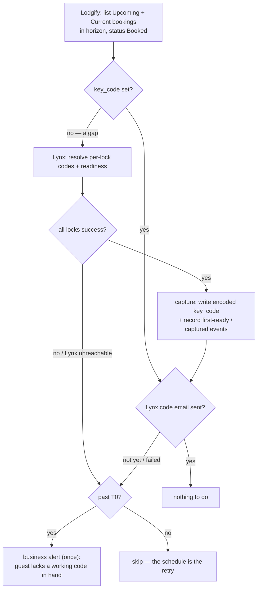

# sure-lock — monitoring architecture & design

**sure-lock** is the monitoring milestone of `@twin-digital/lock-link`: it watches the
Lynx → guest door-code pipeline end to end, captures per-lock codes into **Lodgify** (the
PMS / system of record for bookings), records durable evidence about how reliably **Lynx** (the
smart-lock management system) behaves, and alerts the business when a situation needs a human.
It sends **nothing to guests** — Lynx remains the delivery system; sure-lock measures it and
backstops it with alerts.

Two goals drive the design:

1. **Evidence.** The property manager's experience is that Lynx's code delivery is unreliable,
   but the evidence is anecdotal. sure-lock turns that into per-booking records — provisioning
   latency, check-in misses, guest complaints, manual workarounds — durable and queryable enough
   to support conversations with Lynx support weeks or months after the incidents happened.
2. **Lightweight protection.** Until guest messaging ships, the property manager is the delivery
   channel of last resort. sure-lock tells them when to act — a booking near arrival with no
   working code, a lock offline before a check-in, a guest reporting an access problem — and
   puts the door code in the alert body when one exists, so acting means forwarding a code, not
   investigating one. Codes-in-alerts is an accepted trade-off: the exposure matches Lynx's own
   guest emails.

The guest-messaging system — sending codes through Lodgify's inbox, the emergency-code pool for
provisioning failures — is a planned **extension** of sure-lock, tracked separately. sure-lock
is deliberately a subset: everything here (capture, timing, evidence, alerting) carries forward
unchanged when the extension lands.

**What it does:** a scheduled loop that, per tick —

1. **Captures**: once Lynx reports every lock provisioned for a booking, writes the per-lock
   codes into the Lodgify booking's `key_code` field.
2. **Observes**: records evidence events — provisioning transitions, lock health changes, guest
   complaints, manual workarounds — to a DynamoDB evidence store and CloudWatch metrics.
3. **Alerts the business** when — and only when — a human action is needed, on a channel
   separate from the operational alerts engineering receives about system faults.

This document covers the what, why, and when. Endpoint-level contracts, wire shapes, and
provenance live in the per-API references: **[lynx-api.md](./lynx-api.md)** and
**[lodgify-api.md](./lodgify-api.md)**. Integration contracts for capture, Lynx's email-status
read, and thread reads are proven against live data; residual unknowns are called out in Open
questions.

---

## Data flow

**Lodgify-driven, gap-fill.** Drive from the official Lodgify API and touch the unofficial Lynx
API only for actual gaps and slow-cadence observation — Lynx usage scales with new near-term
bookings, not calendar size.

> [!NOTE]
> **T0** is the instant a booking becomes _overdue_: old enough that provisioning should have
> happened, close enough to arrival that it matters. The precise (piecewise) definition is in
> the Timing section.

Alongside the capture flow, slower-cadence **observers** run on the interval gates described
under Timing:

- **Lock & hub health sampler** — connectivity, battery, jam, and provisioning status per lock;
  records state changes and alerts on an unhealthy lock ahead of an arrival.
- **Thread scanner** — reads the message threads of active-window bookings for guest access
  complaints and for the manager's manual code sends (the workaround burden).
- **Notes scanner** — reads booking notes for the manager's tagged phone-workaround entries.
- **Capture verifier** — re-checks captured in-horizon bookings against Lynx and flags any code
  that changed after capture.

**Statelessness governs decisions; DynamoDB stores evidence.** Every _decision_ is re-derived
each tick from the two APIs and the clock: `key_code` empty/set is the capture state, and all
timing decisions are pure functions of the tick time. The evidence store is write-mostly — it
exists so observations survive log retention, and it doubles as the **alert ledger** (an alert
that has fired is recorded, so alerts fire once without any in-memory state). Nothing else about
the loop's behavior depends on reading it back.

**The join** between systems is Lynx's `confirmationCode`, which embeds the Lodgify booking id
(`20559349VK222262` → booking `20559349`). A `confirmationCode` that doesn't match the expected
shape escalates — a free integrity check. Mechanics and the Lynx ID model:
[lynx-api.md](./lynx-api.md).

**Warm-path memoization.** An invocation may memoize **immutable facts** in module scope and
skip re-reading them while the Lambda stays warm. The rule: memoize only **monotonic** facts,
not mutable observations (not-ready, lock health), which are exactly what each tick exists to
re-check. This serves a standing non-functional requirement: **minimize calls to the unofficial
Lynx API**. sure-lock's Lynx footprint is read-only — `login` plus read endpoints; no
user-management or any other write ever occurs — which also keeps the integration's profile low.

---

## Timing

Time drives most behavior in the system, so it is specified in one place. **Every time value is
env-tunable — no timing constants in code.** The one value that lives in infrastructure (the
EventBridge cron rate) is derived in `stack.ts` from the same constant that sets
`LOCK_LINK_TICK_MINUTES`, so the rule and the Lambda can't drift apart.

| Env var                                | Default | Units   | Governs                                       |
| -------------------------------------- | ------- | ------- | --------------------------------------------- |
| `LOCK_LINK_TICK_MINUTES`               | 10      | minutes | Tick rate (stack-derived with the cron rule)  |
| `LOCK_LINK_HORIZON_DAYS`               | 14      | days    | Which upcoming bookings the loop considers    |
| `LOCK_LINK_LYNX_SLOW_INTERVAL_MINUTES` | 60      | minutes | Slow-tier Lynx re-checks and the observers    |
| `LOCK_LINK_FAST_POLL_HOURS`            | 24      | hours   | Fast-tier polling boundary before arrival     |
| `LOCK_LINK_SLA_HOURS`                  | 8       | hours   | Escalation clock                              |
| `LOCK_LINK_GRACE_MINUTES`              | 30      | minutes | New-booking escalation suppression            |
| `LOCK_LINK_POST_CHECKIN_GRACE_MINUTES` | 10      | minutes | Tightened grace once check-in time has passed |
| `LOCK_LINK_CRITICAL_HOURS`             | 6       | hours   | Severity is critical inside this window       |
| `LOCK_LINK_THREAD_TRAILING_HOURS`      | 24      | hours   | How long past departure threads stay watched  |

Cold-start validation enforces `FAST_POLL_HOURS > SLA_HOURS > CRITICAL_HOURS` (fast polling
begins before the escalation clock runs out, which runs out before maximum urgency),
`POST_CHECKIN_GRACE_MINUTES ≤ GRACE_MINUTES` (the system must not get _lazier_ once the guest
may be physically present), and the interval gate (`LYNX_SLOW_INTERVAL_MINUTES`) ≥ the tick
rate — a gate shorter than a tick would degenerate to "every tick". The graces are exempt: they
are age thresholds, not gates, and may legitimately be shorter than or equal to a tick.

### The three timing mechanisms

1. **Windows** — pure functions of (tick time, booking timestamps): horizon, fast-poll window,
   SLA, graces, severity. Recomputed every tick, so a booking's treatment changes as the clock
   runs down with no stored state.
2. **Interval gates** — `epoch(scheduledTime) % INTERVAL < TICK` ("the first tick of each
   interval"): the Lynx slow tier and the observers. Stateless: the schedule is the state; no
   check timestamps are stored anywhere.
3. **Threshold crossings** — deterministic instants derived from the windows. A booking becomes
   overdue at **T0**, where the applicable grace is `GRACE` before check-in and
   `POST_CHECKIN_GRACE` after: `T0 = max(arrival − SLA, created + GRACE)` when that lands before
   check-in, otherwise `max(checkIn, created + POST_CHECKIN_GRACE)`. Note the deliberate
   discontinuity: a booking whose age at check-in is between the two graces breaches _exactly at
   check-in_ — the guest just became present. (For bookings made in advance, `arrival − SLA`
   dominates and neither grace matters.)

All three key off the **scheduled** tick time from the trigger event (`event.time`), not the
wall clock — delivery jitter, cold starts, and async-retry redelivery all resolve to the same
logical tick.

### Cadence & Lynx tiering

The rule fires every `TICK_MINUTES`, but Lynx re-checks are tiered so Lynx pressure scales with
urgency, not with the clock:

- Gaps with arrival **inside `FAST_POLL_HOURS`** (including past-check-in bookings) → Lynx
  re-checked **every tick**. These are the bookings where readiness latency is guest-facing —
  and where sure-lock's latency measurements need tick-level resolution.
- Gaps **outside** that window → Lynx re-checked only on the slow-interval gate. A booking
  arriving next week loses nothing by being re-checked hourly.
- **Email-status checks** follow the same tiering, for every in-horizon reservation until
  `sentStatus: 1` is observed — a send is monotonic, so it memoizes for the warm lifetime and
  the polling stops.
- The **observers** (health sampler, thread scanner, notes scanner, capture verifier) run on the
  slow-interval gate: their findings are advisory or evidentiary, and an hour of detection
  latency is acceptable for all of them.

At steady state (no gaps, all in-horizon sends observed) the fast cadence costs only a Lodgify
list read per tick.

### Booking classification

Every metric and alert is segmented by **booking class**, computed from the Lodgify
`created_at` and the property-local check-in datetime (timezone from Lynx's property record):

- **advance** — booked before arrival day
- **same-day, before check-in**
- **same-day, at/after check-in** — the standing-in-the-rain case

plus **channel** (Expedia / Booking.com / Airbnb / direct / manual, from the Lodgify `source`)
and **guest-email class** (OTA relay address vs. direct). The unreliability being measured is
suspected to be channel-shaped; unsegmented aggregates would blur exactly the pattern the
evidence needs to show. A 60-day pre-launch distribution of these classes is recorded in
[calibration-baseline.md](./calibration-baseline.md).

### Latency measurement

Lynx keeps no event history (no timestamps on reservations or access codes, and `past`
reservations clear `accessCodes` — see [lynx-api.md](./lynx-api.md)), so provisioning latency
can only be measured by observing transitions live. This is sure-lock's core job: per booking,
the observed transitions (first seen as gap, first seen ready, captured) with the Lodgify
`created_at` as the clock-start. Resolution equals the polling cadence — one tick inside the
fast window, the slow interval outside it. The pre-launch baseline (two observed provisioning
latencies at ±1 h resolution, from the earlier hourly sync) is in
[calibration-baseline.md](./calibration-baseline.md); sure-lock's records supersede it.

---

## Readiness

Lock provisioning is **eventually consistent** (Lynx scheduling, lock memory limits, hub comms,
transient errors), so a reservation legitimately spends part of its life only partly
provisioned.

- **Ready** = the reservation's access codes cover **every** lock in the property's lock set,
  each reporting `syncToLockStatus: "success"`. Codes are usually uniform across a reservation's
  locks but **legitimately differ** (observed live 2026-07-07) — capture every lock's code;
  don't require them to match.
- ⚠️ Code _presence_ is not readiness — Lynx assigns the code up front, before it reaches the
  hardware. Only all-locks-`success` is. A partial/unsynced code set is worse than none and is
  not captured.
- **Not ready is normal**, not an error — skip and re-check next tick. Escalation only enters at
  T0.
- **Per-lock attribution**: when a reservation is partially provisioned, the evidence event
  records _which_ lock is lagging. Over time this builds a per-lock reliability ranking — the
  kind of specificity a support conversation needs ("this lock accounts for most sync delays").

Wire details (states, the lock-set denominator): [lynx-api.md](./lynx-api.md).

## The key_code convention

`key_code` is a free-form string that lock-link owns (single-host deployment; nothing else
writes the field, Lodgify's UI never displays it, and no active message template interpolates
it). Encoding:

- all locks share one code → the bare code, e.g. `9234`
- codes differ per lock → a labeled list, e.g. `Front Door: 2968 · Back Door: 3350`, locks
  ordered alphabetically by `lockName` so the encoding is deterministic

The **stateless diff** follows from the convention: compare the booking's current `key_code` to
the string we would write, and write only when they differ. Capture serves three purposes in
sure-lock: it is the stateless capture-state marker, it is the code source for alert bodies (so
the manager can relay a code without opening the Lynx dashboard), and it is the reference value
the capture verifier diffs against.

### Capture verification (code mutation)

On the slow gate, captured in-horizon bookings are re-checked against Lynx: decode the stored
`key_code`, compare against the reservation's current codes, and record + alert (ops) on any
difference. This is an anomaly signal for the evidence trail and it directly tests the
**static-codes assumption** the messaging extension depends on — if codes ever rotate after
provisioning, that needs to be known before guest messages carry captured codes.

### Access-window check

At capture time, each code's `accessStart`/`accessEnd` is compared against the booking's stay.
A code can be all-locks-`success` and still lock the guest out if its validity window doesn't
cover the stay — a failure invisible to readiness. A mismatch records an event and raises a
business alert (the action: verify or extend the code in the Lynx dashboard).

---

## The evidence store

A single DynamoDB table (on-demand billing, point-in-time recovery, no TTL) holding append-only
**evidence events**. CloudWatch metrics remain the operational/alarm surface; the table is the
durable record — support conversations happen weeks or months after the incidents, well past
log retention, and the per-booking event stream is the artifact the property manager brings to
them. At ~28 bookings/week the volume is trivial and the table is effectively free.

**Event kinds** (booking-scoped unless noted):

| Event                         | Recorded when                                                       |
| ----------------------------- | ------------------------------------------------------------------- |
| `booking-observed`            | first sighting in the horizon (carries class/channel/property dims) |
| `lynx-reservation-missing`    | booking has no matching Lynx reservation (first detection)          |
| `first-ready`                 | first tick observing all locks `success`                            |
| `captured`                    | `key_code` written (also emitted for partial-lag details per lock)  |
| `code-mutated`                | capture verifier found a post-capture difference                    |
| `access-window-mismatch`      | code validity window doesn't cover the stay                         |
| `lock-health-changed`         | property-scoped: a lock's health state transitioned                 |
| `complaint-detected`          | guest thread message classified as an access complaint              |
| `manual-send-detected`        | host thread message containing a door code                          |
| `workaround-noted`            | tagged phone-workaround line found in booking notes                 |
| `alert-fired`                 | any business/ops alert (doubles as the alert ledger)                |
| `lynx-email-sent` / `-failed` | first tick observing the code email's `sentStatus` at `1` / `2`     |

**Keying sketch** (finalized at implementation): booking-scoped events partition on
`BOOKING#<lodgifyBookingId>`, property/lock-scoped on `PROPERTY#<lynxPropertyId>`. One-shot
transition events (`first-ready`, `captured`, `booking-observed`) use deterministic sort keys
with conditional writes, so a retried tick can't duplicate them; recurring observations key on
what was observed (thread message id, notes-line hash, health-transition instant). Events
denormalize the segmentation dimensions (class, channel, property, lock) so evidence queries
need no joins. A GSI on event type + time serves "all check-in misses in June" style questions.

**Alert ledger.** `alert-fired` events give every alert once-per-condition semantics: before
firing, the loop checks the ledger for that alert key. If the ledger read itself fails, the
alert fires anyway — a duplicate alert beats a silent miss — and the write is retried by the
next tick's re-derivation.

**Write-failure posture**: an event write that fails after its observation is a bounded
evidence loss (the observation re-derives next tick for standing conditions; a one-shot
transition may lose its precise timestamp). Failures count on an ops metric; they never block
capture or alerting.

## Metrics catalog

What sure-lock measures, which goal each serves, and what it depends on:

| Metric                                                                         | Serves                         | Status                             |
| ------------------------------------------------------------------------------ | ------------------------------ | ---------------------------------- |
| Provisioning latency (created → ready → captured), segmented                   | evidence, calibration          | ready — proven contracts           |
| **Check-in miss rate** (% without a working code at check-in / T-8 h / T-24 h) | evidence (headline)            | ready — derived from transitions   |
| Bookings absent from Lynx entirely                                             | evidence, alerting             | ready                              |
| Per-lock sync-lag attribution                                                  | evidence                       | ready                              |
| Lock/hub health time-series (offline windows, battery, jams)                   | evidence, alerting             | ready                              |
| Access-window mismatches                                                       | evidence, alerting             | ready                              |
| Post-capture code mutation                                                     | evidence, extension de-risking | ready                              |
| Guest access complaints (thread)                                               | evidence, alerting             | ready — keyword list open          |
| Manual workarounds (host code sends + tagged phone notes)                      | evidence                       | notes round-trip probe pending     |
| Lynx email send failures                                                       | evidence, alerting             | ready — sent ≠ received caveat     |
| Email send timing vs. check-in, by booking class                               | evidence                       | ready — observed-transition timing |

The check-in miss rate is the headline: "per Lynx's own API, X of Y guests had no working code
at check-in this month" is the sentence that turns vibes into a support ticket.

## Watching the guest thread & booking notes

Lodgify's official API exposes both surfaces read-only to sure-lock (wire details:
[lodgify-api.md](./lodgify-api.md)):

- **Guest complaints**: `Renter`-type messages in the booking's thread are matched against a
  configurable keyword list (door code / lock / access terms). A match records an event (keyed
  by the thread message id, so re-scans can't duplicate it) and raises a business alert carrying
  the captured code. The exact term list is tuned with the property manager.
- **Manual code sends**: since sure-lock sends nothing, every `Owner`-type message is the
  manager's. One containing a door code (the captured code, or a code-shaped token) is recorded
  as a manual workaround — measuring what unreliable delivery costs in human effort today, and
  providing the before/after baseline for the messaging extension.
- **Phone workarounds**: Lodgify's inbox has no internal-notes feature, but the **booking's
  `notes` field** (editable by the manager in the Lodgify dashboard and mobile app, readable via
  the API) serves as the log. Convention: a line starting with a tag (working default
  `#code-call`, final form agreed with the manager) records a phone-call workaround; the notes
  scanner parses tagged lines into events, deduplicated by line content. sure-lock reads `notes`
  and never writes it, so there is no clobbering risk against the manager's edits.

**Scan window & cost**: threads and notes are scanned on the slow gate, for bookings from
`FAST_POLL_HOURS` before arrival through `THREAD_TRAILING_HOURS` past departure — the span in
which access problems and workarounds occur. At this account's volume that is a handful of
bookings per pass against the official (rate-limited but permitted) API; complaint-alert latency
is bounded by the slow interval.

## Lynx email delivery status

Lynx emails guests their codes itself, and its dashboard API records the outcome per
reservation: `getAccessCodeEmailStatus` returns a tri-state `sentStatus` — not yet attempted /
sent / failed (wire details:
[lynx-api.md](./lynx-api.md#access-code-email-status--getaccesscodeemailstatus)). sure-lock
polls it for in-horizon reservations on the same fast/slow tiering as readiness, records the
transitions as `lynx-email-sent` / `lynx-email-failed` events, and stops polling a reservation
once `sent` is observed (a send is monotonic, so it memoizes).

What this yields:

- **Send timing vs. check-in**, segmented by booking class. The response carries no timestamp
  (like the rest of the Lynx API), so the send time is the observed transition time, at
  polling-cadence resolution.
- **Failure counts** (`sentStatus: 2`) — direct, Lynx-recorded evidence of failed sends.
  `errorMessage` has been observed empty even on failure, so the count may be all there is.
- **A delivery leg for the overdue alert**: past T0 with the email unsent or failed, the guest
  plausibly has no code in hand even when the locks are ready — the cause-agnostic business
  alert fires with the captured code so the manager can relay it.

⚠️ Two caveats keep the evidence honest. `sentStatus: 1` means Lynx **dispatched** the email,
not that the guest received it — an OTA relay silently discarding the mail presumably still
reads `sent`, so the suspected relay-blocking failure mode stays invisible here and surfaces
only as guest complaints (which sure-lock counts; correlating `sent` bookings with complaints
is part of the analysis). And the status is a single tri-state per reservation with no history —
any retries or manual re-sends collapse into the current value.

**Historical backfill opportunity**: statuses have been observed retained on much older
reservations (unlike `accessCodes`, which `past` reservations clear). If that holds, a one-time
sweep of the `past` reservation list yields a retroactive send-failure baseline — evidence
covering months before sure-lock launched. Confirm and run at first deploy.

## Lock & hub health

`getSmartLocksByPropertyWithStatus` already returns per-lock health metadata
(`connectivityStatus`, `batteryLevel`, `isJammed`, `provisionStatus`) alongside the lock-set
denominator the capture path needs. The health sampler reads it on the slow gate, emits the
values as metrics, and records a `lock-health-changed` event when a lock's state differs from
its last recorded state. Health windows correlated with provisioning failures ("provisioning
stalls whenever this hub drops") are exactly the evidence that moves a support conversation from
anecdote to mechanism.

Alerting: an unhealthy lock (offline / jammed / battery below threshold) at a property with an
arrival inside `FAST_POLL_HOURS` raises a business alert — someone can check the lock before the
guest reaches it.

## Notifications & escalation

Notifications split by **audience** — who has to act — which turns out to be outcomes vs.
causes:

- **Business** (property manager) — guest-impacting _outcomes_ with an available human action.
  Business alerts are **cause-agnostic**: the overdue alert fires whether the blocker is slow
  Lynx provisioning, a reservation Lynx never received, an unsent or failed code email, or a
  system fault.

  | Alert                                | Trigger                                                                             | Action enabled                                       |
  | ------------------------------------ | ----------------------------------------------------------------------------------- | ---------------------------------------------------- |
  | Guest lacks a working code in hand   | past T0 and: locks not ready, booking absent from Lynx, or code email unsent/failed | relay the code (in the alert body) / call / stand by |
  | Lock unhealthy before an arrival     | offline/jammed/low battery + arrival in `FAST_POLL_HOURS`                           | check the hardware before the guest arrives          |
  | Guest access complaint               | classified `Renter` message                                                         | respond; code included in the alert body             |
  | Access window doesn't cover the stay | capture-time `accessStart`/`accessEnd` mismatch                                     | verify/extend the code in the Lynx dashboard         |

- **Operational** (engineers/maintainers) — system _causes_ needing technical assessment: a
  `confirmationCode` that doesn't parse, schema drift, capture-write failures, evidence-store
  write failures, post-capture code mutation, and the catch-all for whole-run failures. The tech
  team decides what to relay; the business still hears automatically when a system issue
  produces a guest-impacting outcome, because business alerts don't depend on the cause.

**Severity** is the urgency tier (`info`/`warning`/`critical`), orthogonal to audience. For a
booking-scoped alert it is computed from the clock at the moment the alert fires: critical
inside `CRITICAL_HOURS` of arrival (or past it), warning otherwise. Cause-scoped alerts carry a
fixed severity (warning for data anomalies, critical for a dead run).

**Alerts fire once per condition**, deduplicated by the alert ledger (see the evidence store).
The underlying _action_ still retries every tick — the schedule is the retry; only the alert is
one-shot. Configurable re-alerting with an acknowledge mechanism is extension material.

**Plumbing**: one `Notifier` interface (`createSnsNotifier` publishes with severity as the
subject prefix and audience + severity as message attributes), backed by **two SNS topics**
consumed by ARN. CloudWatch alarms (sync health) target the operational topic; business
notifications are runtime-emitted with the booking/guest context — including the door code when
one is captured — that the manager needs to act.

---

## Scope & config

- **Properties are enumerated dynamically** from Lynx's active set, then polled per
  `propertyId`. No static property list. New properties (rare, gated by physical construction)
  are picked up zero-touch.
- **No reservation-level filtering.** Everything in Lynx is Lodgify-linked, so every reservation
  is expected to resolve to a Lodgify booking. A reservation that doesn't resolve escalates
  rather than being silently skipped.
- Volume: ~28 records/week, up to ~6 months ahead → a few hundred records max. Modest request
  rates + jitter, back off on errors.

### Configuration

Timing knobs are tabled in the Timing section. The rest (all required, validated at cold start):

| Env var                              | Purpose                                            |
| ------------------------------------ | -------------------------------------------------- |
| `LOCK_LINK_ACCOUNT_ID`               | Lynx umbrella account id (drives the join suffix)  |
| `LOCK_LINK_USER_ID`                  | Lynx per-user id sent as `hostId`/`loggedInUserId` |
| `LOCK_LINK_BUSINESS_ALERT_TOPIC_ARN` | SNS topic for business alerts (property manager)   |
| `LOCK_LINK_OPS_ALERT_TOPIC_ARN`      | SNS topic for operational alerts (engineers)       |
| `LOCK_LINK_EVENTS_TABLE`             | DynamoDB evidence-store table name                 |
| `LOCK_LINK_LYNX_USERNAME_PARAM`      | SSM SecureString name — Lynx username              |
| `LOCK_LINK_LYNX_PASSWORD_PARAM`      | SSM SecureString name — Lynx password              |
| `LOCK_LINK_LODGIFY_API_KEY_PARAM`    | SSM SecureString name — Lodgify API key            |
| `LOCK_LINK_LYNX_TOKEN_PARAM`         | SSM SecureString name — durable Lynx JWT cache     |

- **SSM SecureString values are populated out-of-band** on initial setup (CFN never sees secret
  material); the stack grants the Lambda `ssm:GetParameter` on the named parameters plus
  `kms:Decrypt` scoped by `kms:ViaService = ssm.<region>.amazonaws.com`. Credentials are read at
  runtime via Powertools with a ~2 h cache.
- **Lynx JWT cache** (`LOCK_LINK_LYNX_TOKEN_PARAM`, read+write at runtime): the Lambda persists
  the minted JWT (valid ~95 days) so cold starts don't repeatedly call `login`; a 401 forces a
  re-mint and write-back. Zero setup — the first-ever run mints normally and creates the
  parameter.

---

## Deployment architecture

- **AWS CDK** app (TypeScript). Deployed to the **saas-apps** account (`444705667097`; test
  account `saas-apps-test` `425946675033`), **us-east-1**.
- **Scheduled Lambda**: `NodejsFunction` (Node 24, esbuild-bundled) on a minute-aligned
  EventBridge cron rule at `TICK_MINUTES` (see Timing). Bundling uses `--conditions=source` so
  workspace deps bundle from source.
- **DynamoDB evidence table**: on-demand billing, point-in-time recovery, no TTL; the Lambda
  gets read/write on it and nothing else does.
- **Package layout — `infra/` + `src/` split** (single package): `infra/` holds the CDK app +
  stack and may depend on `src/`; `src/` holds runtime/handler code. eslint bans importing
  `aws-cdk-lib`/`constructs` or `infra/` from `src/` (one-directional boundary).
- **Observability**: `@twin-digital/observability-lib`
  (`withObservability(handler, { serviceName })`; logger/metrics injected on the handler
  `context`).
- **CI/CD**: GitHub Actions; the `cdk` job assumes `GitHubActionsCdkDeployRole` (saas-apps) via
  OIDC. Deploys are continuous on merge to main.
- **CloudWatch alarms**: `FunctionErrors` and `InvocationsBelowMinimum` carry over from the
  deployed sync (opus#221). ⚠️ The invocation-count threshold assumes the tick rate — retune it
  whenever `TICK_MINUTES` changes (at 10-minute ticks, ~132 of 144 expected/day).

## Module layout

- `lynx/` — client (`login` + `TokenCache` seam, `listProperties`, `listReservations`,
  `listSmartLocks`, `getAccessCodeEmailStatus`), zod schemas, `createSsmTokenCache`.
- `lodgify/` — client (`listBookings`, `getBooking` — including `notes` and `thread_uid`,
  `putKeyCodes`, `getThread`), zod schemas, the vendored OpenAPI + `pull-spec` refresh tool.
- `sync/` — `resolveBookingId(confirmationCode)`, `checkReadiness`, key-code encode/decode,
  `runSync` (the capture phase), `createSnsNotifier`.
- `monitor/` — the observers: health sampler, thread scanner (complaint + manual-send
  classifiers), notes scanner, capture verifier, and the booking classifier shared by all
  segmentation.
- `evidence/` — the DynamoDB event store and the alert ledger.
- `config.ts` — env-sourced, zod-validated config; `secrets.ts` — Powertools SSM reads.
- `functions/sync.ts` — the Lambda handler, wrapped in try/notify/rethrow so a whole-run failure
  reaches the escalation sink.

## Glossary

- **Gap** — a Booked, in-horizon Lodgify booking whose `key_code` is empty: codes not yet
  captured.
- **Horizon** — how far ahead the loop looks at all.
- **Capture** — resolving a gap's per-lock codes from Lynx and writing them (encoded) to
  `key_code`. Requires readiness.
- **Readiness** — every lock in the room's lock set has this reservation's code with
  `syncToLockStatus: "success"`; codes may differ per lock.
- **Fast-poll window** — the span before arrival in which gaps get per-tick Lynx checks; opens
  at `FAST_POLL_HOURS`.
- **SLA** — the expectation that a booking has a working code by `SLA_HOURS` before arrival;
  breaching it triggers escalation.
- **Grace** — suppression of escalation while a booking is too new for Lynx to have plausibly
  provisioned it; a tighter value applies past check-in.
- **Breach (T0)** — the derived instant a booking becomes overdue:
  `max(arrival − SLA, created + GRACE)`, or `max(checkIn, created + POST_CHECKIN_GRACE)` past
  check-in.
- **Booking class** — advance / same-day-before-check-in / same-day-at-or-after-check-in; a
  segmentation dimension on every metric.
- **Evidence event** — one durable observation in the DynamoDB store.
- **Alert ledger** — `alert-fired` events; presence gives alerts once-per-condition semantics.
- **Observer** — a slow-gate scan (health, threads, notes, capture verification) that records
  evidence and may alert, and is not part of the capture decision path.
- **Severity / Audience** — urgency tier (`info`/`warning`/`critical`) / who acts (business vs.
  operational).
- **Tick** — one scheduled run; all time logic keys off its _scheduled_ fire time.
- **Interval gate** — the stateless pattern `epoch(scheduledTime) % INTERVAL < TICK`: acts on
  the first tick of each interval.

## Appendix: failure-mode catalog

**Retry philosophy: the schedule is the retry.** Nothing loops in-run (single exception: one JWT
re-mint on a Lynx 401); every per-booking failure leaves state untouched so the next tick
re-attempts. EventBridge's async redelivery (up to 2 retries on function error) is harmless by
the same idempotency.

| #   | Failure                                            | System response                                                                                             | Audience / severity             | Retry                       |
| --- | -------------------------------------------------- | ----------------------------------------------------------------------------------------------------------- | ------------------------------- | --------------------------- |
| 1   | Bad/missing env config at cold start               | Throws before the notifier exists — Lambda invocation error                                                 | — (alarm only)                  | Next tick                   |
| 2   | Secrets unreadable (SSM/KMS)                       | Whole-run failure: catch-all notify + rethrow                                                               | Ops / critical                  | Next tick                   |
| 3   | SNS publish itself fails                           | Error propagates → Lambda error; the alarm layer backstops the notifier                                     | — (alarm only)                  | Next tick                   |
| 4   | Lodgify list/read down, 401, 5xx, schema drift     | Whole-run failure (can't enumerate)                                                                         | Ops / critical                  | Next tick                   |
| 5   | Lynx login fails (bad creds)                       | Whole-run failure                                                                                           | Ops / critical                  | Next tick                   |
| 6   | Lynx 401 mid-run                                   | Re-mint once, retry the call; a second failure → whole-run                                                  | Ops / critical (2nd only)       | In-run once, then next tick |
| 7   | Lynx down / 5xx / drift on one property            | Property-scoped failure: skip the property, continue _(depends on opus#201; today aborts the run)_          | Ops / warning                   | Next tick                   |
| 8   | `confirmationCode` unparseable                     | Skip the reservation, continue                                                                              | Ops / warning (once)            | Next tick                   |
| 9   | Same booking id resolved from two properties       | Keep the first entry, alert                                                                                 | Ops / warning                   | Next tick                   |
| 10  | Lodgify booking with no Lynx reservation           | Evidence event; the cause-agnostic overdue alert covers it at T0                                            | Business (severity at T0, once) | Every tick                  |
| 11  | Locks not ready (the normal case)                  | Skip; transition evidence recorded                                                                          | none until T0                   | Fast/slow tier per window   |
| 12  | Still not ready at T0                              | Business alert (once, via the ledger) with per-lock status; capture keeps retrying                          | Business (severity at T0)       | Every tick (alert once)     |
| 13  | Code email unsent/failed at T0 (locks ready)       | Evidence event; the same cause-agnostic overdue alert, with the captured code in the body                   | Business (severity at T0, once) | Every tick (alert once)     |
| 14  | `putKeyCodes` 404/400, or read-back mismatch       | Skip the booking; it remains a gap                                                                          | Ops / warning                   | Next tick                   |
| 15  | Booking missing `thread_uid`, or thread read fails | Skip that booking's thread scan                                                                             | Ops / warning (once)            | Next slow gate              |
| 16  | Evidence-store write fails                         | Bounded evidence loss (standing conditions re-derive; a one-shot transition may lose its precise timestamp) | Ops metric; alarm on rate       | Next tick                   |
| 17  | Alert-ledger read fails                            | Fire the alert anyway — a duplicate beats a silent miss                                                     | Ops metric                      | Next tick                   |
| 18  | Post-capture code mutation detected                | Evidence event + alert; `key_code` is **not** auto-rewritten (a mutation is an anomaly to understand first) | Ops / warning                   | Next slow gate              |
| 19  | Access window doesn't cover the stay               | Evidence event + alert                                                                                      | Business / warning              | Next slow gate              |
| 20  | Notes present but no parseable tag lines           | Ignored — notes are the manager's field; only tagged lines are ours                                         | —                               | —                           |

## Open questions / follow-ups

- **Email-status retention for past reservations** — statuses have been observed on much older
  reservation ids; confirm `past`-type reservations answer `getAccessCodeEmailStatus`, then run
  the one-time historical backfill.
- **`reservationId` join for the email-status call** — confirm it is the reservations list's
  `bookingId` (presumed from the dashboard's usage).
- **When Lynx schedules its send** — unknown (a `0` status on a provisioned reservation may
  mean "scheduled for later"); the send-timing metric itself answers this within the first
  weeks of data.
- **Booking-notes round trip** — confirm a note entered in the Lodgify dashboard/app surfaces in
  the API's `notes` field, and whether the list endpoint populates it or only the per-booking
  read (harmless either way — the per-booking read happens regardless for `thread_uid`).
- **Complaint keyword list and the notes tag convention** — agree both with the property
  manager before launch.
- **Evidence-store key schema** — finalize at implementation (the sketch above fixes the
  semantics: deterministic one-shot events, observation-keyed recurring events, denormalized
  dimensions).

Extension material — guest messaging through Lodgify's inbox, the emergency-code pool and its
reconciler, configurable re-alerting — is deliberately absent here and tracked with the
messaging-pivot architecture work. When the extension lands, the fast-poll window aligns with
the send window, the capture phase is unchanged, and the evidence store's calibration data is
what prices the extension's timing knobs.
