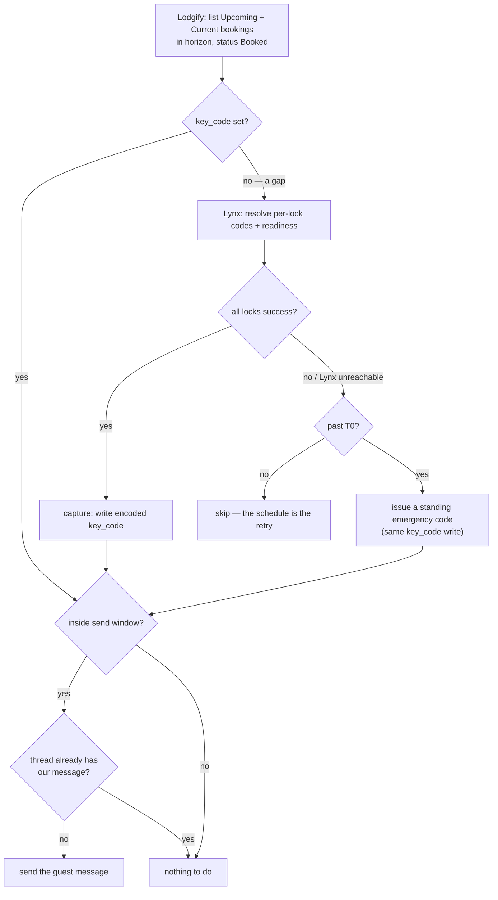
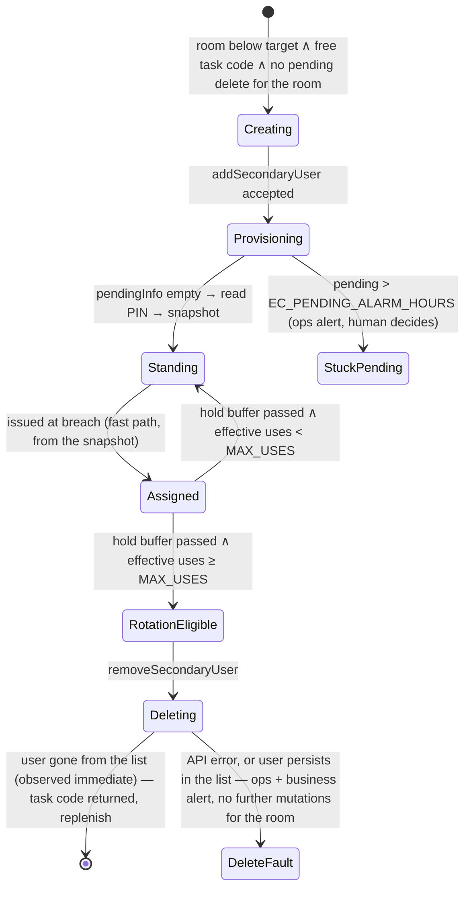

# lock-link — architecture & design

`@twin-digital/lock-link` delivers smart-lock door codes to guests booked through **Lodgify**
(short-term-rental PMS / channel manager), sourcing the codes from **Lynx** (the smart-lock
management system).

**Why it exists:** Lynx is supposed to do this itself — it generates per-reservation codes and
emails them to guests. In practice its delivery is unreliable, especially for OTA guests behind
relay addresses (Expedia, Booking.com), and Lynx support was unable to resolve it. lock-link
gives the property manager **reliable, observable door-code delivery**, sending through
Lodgify's messaging so every guest conversation stays in the unified inbox. Owning the message
(rather than letting Lodgify's "X days before arrival" templates deliver a code field) is also
what makes two things possible: carrying a **different code per lock** on one reservation — a
requirement Lynx imposes by not guaranteeing code uniformity, not a feature we set out to
build — and **holding delivery until provisioning has actually succeeded** — a template fires on
schedule even when the code isn't ready, worst on last-minute bookings where "1 day before"
means "immediately".

The constraint chain, compactly: commercial locks (DormaKaba) → Lynx is the only middleware that
drives them from a vacation-rental PMS → OTAs structurally block third-party senders (so Lynx's
own emails can't deliver) → Lynx doesn't push codes into Lodgify (so Lodgify's first-class OTA
messaging can't carry them) → the PMSs Lynx does push into have disqualifying OTA gaps → and
no PMS's scheduled messaging will hold a guest message until the code exists (the gating that
exists is bounded — capped holds, retry windows that silently drop — or absent), so late
bookings get blank, stale, or dropped code messages regardless. (The vendor research and the
client proposal that substantiate this chain are tracked separately, in a follow-up.)

**What it does:** a scheduled loop that, per booking —

1. **Captures**: once Lynx reports every lock provisioned, writes the per-lock codes into the
   Lodgify booking's `key_code` field.
2. **Messages**: once arrival is near, sends the guest their codes through Lodgify's messaging
   API, exactly once.
3. **Falls back**: if a booking goes overdue with its code still unprovisioned, issues one of
   the room's pre-provisioned **emergency codes** through the same two steps, so the guest is
   never left standing outside.
4. **Notifies the business** when — and only when — a human action is needed (call the guest,
   ready a fallback, check a lock), on a channel separate from the operational alerts
   engineering receives about system faults.

This document covers the what, why, and when. Endpoint-level contracts, wire shapes, and
provenance live in the per-API references: **[lynx-api.md](./lynx-api.md)** and
**[lodgify-api.md](./lodgify-api.md)**. All integration contracts are proven against live data.

---

## Data flow

**Lodgify-driven, gap-fill.** Drive from the official Lodgify API and touch the unofficial Lynx
API only for actual gaps — Lynx usage scales with new near-term bookings (not calendar size) and
quiesces to **zero** once everything in-horizon has its codes.



Escalation runs alongside every step: bookings that are overdue and still unmessaged — or whose
guest is unreachable — notify the appropriate audience (see Notifications & escalation).

> [!NOTE]
> **T0** is the instant a booking becomes _overdue_: old enough that provisioning should have
> happened, close enough to arrival that it matters. It triggers both the emergency fallback and
> the first escalation, and it appears throughout this doc — the precise (piecewise) definition
> is in the Timing section.

**Capture and message are decoupled — but pipelined within a tick.** Capture usually runs
days-to-weeks before the send window opens, and once it lands the codes live in Lodgify's own
booking record: at send time the only dependency is Lodgify, so a Lynx outage can delay capture
(the schedule retries it, with lots of slack) but can never block a send. The `key_code` field
doubles as the local store — no separate database; the state rides in the system of record for
the booking itself. Within a single run, each booking flows capture → message in one pass: a
booking that becomes ready inside the send window is messaged in the same invocation, never
parked for the next tick.

**Degraded mode: manual capture.** Capture is the _only_ step that requires the Lynx API. If
Lynx access is ever lost — a breaking change that can't reasonably be accommodated, or access
revoked outright — the system degrades, in order: already-captured bookings message normally
(send needs only Lodgify); the emergency pool keeps issuing without Lynx (the snapshot is
Lynx-independent and the codes are already in the locks — weeks of coverage at observed
same-day rates); and permanently, staff can read codes off the Lynx dashboard and enter them
into Lodgify's key-code field by hand, at which point **everything downstream still works** —
timing, verified sending, read-before-send, delivery tracking, escalation. Total Lynx API loss
reduces the system to "staff type one code per booking," not to nothing.

**The join** between systems is Lynx's `confirmationCode`, which embeds the Lodgify booking id
(`20559349VK222262` → booking `20559349`). A `confirmationCode` that doesn't match the expected
shape escalates — a free integrity check. Mechanics and the Lynx ID model:
[lynx-api.md](./lynx-api.md).

**Statelessness is the design's backbone.** Every run re-derives everything from the two APIs
and the clock: `key_code` empty/set is the capture state, the message thread is the sent state,
and all timing decisions are pure functions of the tick time (see Timing). There is nothing to
migrate, repair, or drift.

**Warm-path memoization.** Statelessness governs correctness, not cost: an invocation may
memoize **immutable facts** in module scope and skip re-reading them while the Lambda stays warm
(typically well past the 10-minute tick). The rule: memoize only **monotonic** facts — a sent
message stays sent; a user's PIN never changes for that user id — never mutable observations
(not-ready, not-sent, standing counts), which are exactly what each tick exists to re-check. A
cold start means an empty memo and a full re-derive: identical behavior, different cost. Applied
where reads are chattiest: the per-booking sent-check (an already-messaged booking skips its
thread read for the rest of the stay) and Lynx user PINs. This also serves a standing
non-functional requirement: **minimize calls to the unofficial Lynx API**.

> [!IMPORTANT]
> **We assume door codes are static once set.** A Lodgify booking that already has a `key_code`
> is treated as captured and never re-checked against Lynx, so a _rotation_ of the code in Lynx
> after capture would not propagate — the guest would be messaged the captured codes. The data
> suggests codes are assigned once and stable. If that proves untrue, add a best-effort re-check
> at send time (see open questions) or a scheduled reconciliation for the in-horizon set.

---

## Timing

Time drives almost every behavior in the system, so it is specified in one place. **Every time
value is env-tunable — no timing constants in code.** The one value that lives in infrastructure
(the EventBridge cron rate) is derived in `stack.ts` from the same constant that sets
`LOCK_LINK_TICK_MINUTES`, so the rule and the Lambda can't drift apart.

| Env var                                   | Default | Units   | Governs                                           |
| ----------------------------------------- | ------- | ------- | ------------------------------------------------- |
| `LOCK_LINK_TICK_MINUTES`                  | 10      | minutes | Tick rate (stack-derived with the cron rule)      |
| `LOCK_LINK_HORIZON_DAYS`                  | 14      | days    | Which upcoming bookings the loop considers        |
| `LOCK_LINK_LYNX_SLOW_INTERVAL_MINUTES`    | 60      | minutes | Lynx re-check gate outside the send window        |
| `LOCK_LINK_SEND_HOURS`                    | 24      | hours   | Send window opens; fast-tier polling boundary     |
| `LOCK_LINK_SLA_HOURS`                     | 8       | hours   | Escalation clock; emergency-issuance trigger      |
| `LOCK_LINK_GRACE_MINUTES`                 | 30      | minutes | New-booking escalation suppression                |
| `LOCK_LINK_POST_CHECKIN_GRACE_MINUTES`    | 10      | minutes | Tightened grace once check-in time has passed     |
| `LOCK_LINK_CRITICAL_HOURS`                | 6       | hours   | Severity flips to critical inside this window     |
| `LOCK_LINK_REALERT_CRITICAL_MINUTES`      | 60      | minutes | Re-alert gate at critical severity                |
| `LOCK_LINK_REALERT_WARNING_MINUTES`       | 240     | minutes | Re-alert gate at warning severity                 |
| `LOCK_LINK_REALERT_INFO_MINUTES`          | 1440    | minutes | Re-alert gate at info severity                    |
| `LOCK_LINK_EC_HOLD_BUFFER_HOURS`          | 24      | hours   | Issued emergency code protected after departure   |
| `LOCK_LINK_EC_PENDING_ALARM_HOURS`        | 36      | hours   | Alarm on an emergency create still provisioning   |
| `LOCK_LINK_EC_RECONCILE_INTERVAL_MINUTES` | 360     | minutes | Emergency-pool reconciler gate                    |
| `LOCK_LINK_EC_USE_DECAY_DAYS`             | 90      | days    | Emergency-code uses older than this stop counting |

Cold-start validation enforces `SEND_HOURS > SLA_HOURS > CRITICAL_HOURS` (the send window opens
before the escalation clock runs out, which runs out before maximum urgency),
`POST_CHECKIN_GRACE_MINUTES ≤ GRACE_MINUTES` (the system must never get _lazier_ once the guest
may be physically present), and every **interval gate** (`LYNX_SLOW_INTERVAL_MINUTES`, the three
`REALERT_*` intervals, `EC_RECONCILE_INTERVAL_MINUTES`) ≥ the tick rate — a gate shorter than a tick would degenerate to
"every tick". The graces are exempt: they are age thresholds, not gates, and may legitimately be
shorter than or equal to a tick (a 10-minute grace on a 10-minute tick simply means the breach
is acted on at the first tick after it).

### The three timing mechanisms

1. **Windows** — pure functions of (tick time, booking timestamps): horizon, send window, SLA,
   graces, severity. Recomputed every tick, so a booking's treatment changes as the clock runs
   down with no stored state — an unresolved booking naturally escalates from warning to
   critical as arrival approaches.
2. **Interval gates** — `epoch(scheduledTime) % INTERVAL < TICK` ("the first tick of each
   interval"): the Lynx slow tier and re-alert throttling. Stateless: the schedule is the state;
   no check or alert timestamps are stored anywhere. Intervals are arbitrary tunables — no need
   to align to hours.
3. **Threshold crossings** — deterministic instants derived from the windows. A booking becomes
   overdue at **T0**, where the applicable grace is `GRACE` before check-in and
   `POST_CHECKIN_GRACE` after: `T0 = max(arrival − SLA, created + GRACE)` when that lands before
   check-in, otherwise `max(checkIn, created + POST_CHECKIN_GRACE)`. Note the deliberate
   discontinuity: a booking whose age at check-in is between the two graces breaches _exactly at
   check-in_ — the guest just became present. (For bookings made in advance, `arrival − SLA`
   dominates and neither grace matters.) Severity upgrades at `arrival − CRITICAL_HOURS`. A tick
   acts unthrottled iff a threshold falls inside `(previousTick, thisTick]` — first alerts are
   prompt and severity upgrades immediate, still with no alert ledger.

All three key off the **scheduled** tick time from the trigger event (`event.time`), not the
wall clock — delivery jitter, cold starts, and async-retry redelivery all resolve to the same
logical tick. Snap the received time to the tick grid for sub-minute wobble. The interval-gate
guarantee is "at most one action per interval"; if that one tick errors out, the interval is
skipped — bounded staleness that never affects in-window gaps (checked every tick regardless).

### Cadence & Lynx tiering

The rule fires every `TICK_MINUTES`, but Lynx re-checks are tiered so Lynx pressure scales with
urgency, not with the clock:

- Gaps **inside the send window** (including past-check-in bookings) → Lynx re-checked **every
  tick**. These are the bookings where readiness latency is guest-facing.
- Gaps **outside the send window** → Lynx re-checked only on the slow-interval gate. A booking
  arriving next week loses nothing by being re-checked hourly.

At steady state (no gaps) even the slow-tier tick makes no Lynx calls; the faster cadence costs
only a Lodgify list read per tick. Worst-case detection latency for a same-day booking is one
tick plus Lynx's own provisioning time.

### Worked example

Booking created **Mon 10:07**, arrival **Thu 16:00** (78 h out), defaults throughout:

- **Mon 10:10** (first tick after creation): enters the horizon as a gap. Outside the send
  window (78 h > 24) → slow tier, Lynx checked roughly hourly.
- **Mon 14:00**: Lynx reports all locks `success` → codes captured to `key_code`. The booking
  idles — messaging isn't allowed yet.
- **Wed 16:00** (T-24 h): send window opens. That tick: thread read → no lock-link message →
  message sent. Done; every later tick sees the message in the thread and does nothing.

Sad-path variant — Lynx never provisions:

- **Thu 08:00** (T-8 h = T0; grace long since passed): breach. This tick fires unthrottled — the
  room's emergency code is issued (written to `key_code`, delivered by the message step) and the
  business alert goes out (warning).
- If somehow still unresolved: **Thu 10:00** (arrival − 6 h) crosses the severity threshold →
  unthrottled **critical** alert, repeating on the 60-minute gate until resolved or checkout.
  (The 240-minute warning gate never gets a turn in this timeline — the upgrade preempts it.)
- Contrast, a late booking created **Thu 14:30** for a Thu 16:00 arrival: born inside every
  window; T0 = created + 30 min = 15:00. If codes sync at 14:52, the 15:00 tick captures _and_
  messages in one pass — nothing ever alerts.

### Post-check-in issuance latency (the rain window)

How long a guest who books **at or after check-in** waits for the emergency fallback, assuming a
standing code is available.

**How to calculate it.** For a booking created at/after check-in, `arrival − SLA` is already in
the past, so `T0 = created + POST_CHECKIN_GRACE`. Issuance (and, pipelined, the message) happens
at the **first tick ≥ T0**, which adds anywhere from 0 to one full `TICK` depending on how T0
lands on the tick grid; delivery adds _slop_ (~½–2 min of invoke lag, run time, and email
delivery). So:

```
wait = POST_CHECKIN_GRACE + U + slop        where U ∈ [0, TICK)

floor   = grace + slop            (T0 lands exactly on a tick)
typical = grace + TICK/2 + slop   (uniform tick alignment on average)
ceiling = grace + TICK + slop     (T0 just misses a tick)
```

With the defaults (grace 10, tick 10): **floor ~10½ min, typical ~16 min, ceiling ~20 min +
slop.**

The grace is the floor and the burn-rate knob (every minute shaved is a minute less for Lynx to
provision before a non-expiring code is consumed — see the calibration trade-off below); the
tick is the variance and is nearly free. Guests who book **before** check-in wait less — with
lead time `C` before check-in, T0 follows the piecewise definition above, so:
`C ≥ GRACE + TICK` (≥ 40 min at defaults) → issued before they arrive, zero wait;
`POST_CHECKIN_GRACE ≤ C < GRACE` → T0 lands exactly at check-in, wait = pure tick alignment
(≤ one tick + slop); `C < POST_CHECKIN_GRACE` → wait ≤ `grace − C + TICK + slop`.

### Latency calibration

Lynx keeps no event history (no timestamps on reservations or access codes, and `past`
reservations clear `accessCodes` — see [lynx-api.md](./lynx-api.md)), so provisioning latency
can only be measured by observing it live. The loop therefore emits calibration metrics as it
works: per gap booking, the observed transitions (first seen as gap, first seen ready, captured,
messaged) with the Lodgify `created_at` as the clock-start. **These give an operator the data to
tune the knobs above** — `SEND_HOURS`, the graces, the tick rate — as real provisioning-latency
distributions emerge; nothing self-tunes. The same-day segment is the one that prices
`POST_CHECKIN_GRACE`: the grace buys rain-minutes at the cost of **emergency-code burn**. If
Lynx's typical same-day provisioning latency exceeds the grace, nearly every booked-at-the-door
guest consumes an emergency code (plus a rotation) that the real code would have overtaken
minutes later — and since an issued reservation is done, the real code never goes out. If typical
latency is below the grace, tightening it is nearly free. A pre-launch baseline — two observed
provisioning latencies and a 60-day booking-timing distribution — is recorded in
[calibration-baseline.md](./calibration-baseline.md).

---

## Readiness

Lock provisioning is **eventually consistent** (Lynx scheduling, lock memory limits, hub comms,
transient errors), so a reservation legitimately spends part of its life only partly
provisioned.

- **Ready** = the reservation's access codes cover **every** lock in the property's lock set,
  each reporting `syncToLockStatus: "success"`. Codes are usually uniform across a reservation's
  locks but **legitimately differ** (observed live 2026-07-07: front door `2968`, back door
  `3350` on one booking) — capture every lock's code; don't require them to match.
- ⚠️ Code _presence_ is not readiness — Lynx assigns the code up front, before it reaches the
  hardware. Only all-locks-`success` is. **Never capture a partial/unsynced code set**: a code
  that opens some doors is worse than none.
- **Not ready is normal**, not an error — skip and re-check next tick. Escalation only enters at
  the breach threshold (see Timing / Notifications).

Wire details (states, the lock-set denominator, drift policy): [lynx-api.md](./lynx-api.md).

## The key_code convention

`key_code` is a free-form string that lock-link owns (single-host deployment; nothing else
writes the field, Lodgify's UI never displays it, and no active message template interpolates
it). Encoding:

- all locks share one code → the bare code, e.g. `9234`
- codes differ per lock → a labeled list, e.g. `Front Door: 2968 · Back Door: 3350`, locks
  ordered alphabetically by `lockName` so the encoding is deterministic

Emergency codes use the same formats — an issued emergency code is indistinguishable in the
field from a normal one (see Emergency access codes; issuance is recorded by the alert and
metrics, not the field). The human-readable form is cheap insurance, not a live requirement: it
costs nothing over JSON, reads cleanly in API responses and debugging sessions, and would render
usably if Lodgify ever surfaces the field or a template is added later.

The **stateless diff** follows from the convention: compare the booking's current `key_code` to
the string we would write, and write only when they differ. Self-correcting, no snapshot store.

## Messaging the guest

The guest message goes through Lodgify's messaging API so it lands in the **unified inbox**
thread (one conversation view for the host) and is delivered onward to the guest — by email, or
pushed through the booking's channel for OTA bookings (documented but not yet observed live:
verify on the first real OTA send).

A booking is messaged when **all** of these hold — the schedule is the retry:

1. **Codes captured** — `key_code` is set (readiness held at capture time).
2. **Inside the send window** — codes are live on the locks the moment Lynx reports success, so
   messaging weeks ahead is a small security/confusion cost with no benefit; the window bounds
   it. Late bookings need no special case: a booking made 2 hours before arrival is born inside
   the window and is messaged on the first tick after capture.
3. **Not already sent** — **read-before-send**: the booking's thread is read and the send is
   skipped if it already contains our message. The check is an exact match on a deterministic
   `message_id` (UUIDv5 of `bookingId:access-codes`) that we set at send time and Lodgify echoes
   back in thread reads. The server also rejects duplicate `message_id`s outright, which
   backstops the one race read-first can't close (crash between send and the next read).

There is **no cutoff at arrival** — attempts continue until checkout (a guest mid-stay without
their codes still needs them; late beats never). Missing the SLA triggers the _escalation_,
never a stop to sending.

**Content**: fixed template, single-host deployment — greeting with the guest's name, property
name, arrival date, and the codes (one line when uniform, a labeled list per lock when they
differ). Plain text.

**Cross-cutting gotcha** (details in [lodgify-api.md](./lodgify-api.md)): the v1 send endpoint
returns **HTTP 200 even for failures**, with an error envelope in the body — the client parses
the body, and resolves ambiguous errors by re-reading the thread rather than interpreting error
text. Delivery is observable after the fact via each message's `message_status`
(Submitted/Sent/Delivered/Failed) and the thread's `is_closed` flag; both feed escalation.

## Emergency access codes (capture fallback)

Each room/unit keeps a **warm pool of standing emergency codes** live in its locks (one code
opens all of the room's locks). When a reservation breaches T0 with its guest code still
unprovisioned, the capture phase falls back to one of the room's standing codes instead of
leaving the guest without access: the code is written to `key_code` using the ordinary encoding
and the **normal message step delivers it** — same thread, same dedup, same template. From the
guest's and the loop's perspective an emergency code is a normal code; only its **source**
differs. Issuance is recorded by the issuance metric and the message itself; it does **not**
alert anyone — alerts fire only when a human action is needed (see Notifications & escalation).

**Issuance is Lynx-independent.** The trigger — gap ∧ past T0 — is computable from Lodgify and
the clock alone, and the pool lookup needs only the booking's Lodgify `property_id`. A failed
Lynx check that tick, a Lynx-wide outage, or a reservation Lynx never received does not block
the fallback — those are precisely the scenarios it exists for.

- **Pool snapshot**: an SSM SecureString (`LOCK_LINK_EMERGENCY_CODES_PARAM`) holding a JSON map
  of **Lodgify `property_id`** → **list of code objects**:
  `{ "<lodgifyPropertyId>": [{ "code": "1234", "userId": 111111, "createdAt": "…", "assignedBookings": [{ "bookingId": 123, "issuedAt": "…" }] }, ...] }`.
  Terminology matters here because "cache" is overloaded: this is **Lynx pool state snapshotted
  into SSM by the reconciler** so that issuance never needs Lynx; it is _not_ additionally
  cached in Lambda memory — issuance reads the parameter fresh every time (a stale code is the
  one thing worse than a slow read).
- **Selection**: the **first standing code not currently assigned and with uses remaining**
  (see the reuse policy), in stable creation order
  (the timestamp embedded in each emergency user's name). "Assigned" is derived live: a code
  counts as assigned while it appears in the `key_code` of any booking with
  `departure ≥ now − EC_HOLD_BUFFER` — the same rule that pins deletion — so a code straddling
  a checkout-plus-hold window is **never issued to a second guest**. Pool changes don't perturb
  the ordering: creations append in time order, and deletions only ever remove assigned codes.
- **Non-expiry caveat**: unlike guest codes (which Lynx clears at checkout), an issued emergency
  code stays live until the reconciler rotates it after the stay — a guest retains working
  access until then. This is why rotation is automated, and why a **failed delete alerts the
  business** (a code that should be dead may still open the door — someone can watch for it or
  disable it by hand).
- **Failure handling**: breach with **no standing code available** → business-critical (a code
  is needed and none exists) plus an operational alert; the ordinary overdue-unmessaged
  escalation continues regardless.
- Once issued, the reservation is **done** from the loop's perspective — if the real guest code
  syncs later, no follow-up message is sent (the static-codes assumption applies). Anything
  fancier is a manual step.
- **Rejected**: reading PINs from Lynx at issuance time. The fallback must not depend on the
  system whose failure triggered it. (A lock's `erCode` — its permanent base code — is likewise
  never guest material.)

### The pool reconciler

Lynx has **no native feature for pre-created emergency keys** — but it has primitives that
compose into one:

- A Lynx **user** granted access to locks is assigned a **user-specific door code**, programmed
  into every lock the user can access.
- **Locks are organized into groups**; assigning a user to a group grants access to all of that
  group's locks. One group per room. ⚠️ Prerequisite: these room groups must be created in the
  Lynx dashboard first — none are correctly configured yet.
- So each room holds a pool of synthetic **"emergency users"** — accounts associated with no
  human — whose user codes are the standing emergency codes.
- **Issuing** a code = handing one of these users' door codes to a guest. **Rotating** =
  deleting the user, which revokes the code, then creating a replacement. ⚠️ List removal and
  task-code return are observed to be **immediate**, but clearing the code from lock hardware is
  suspected to take longer (minutes-to-hours) and is **unobservable** — no signal exists to
  verify it. That asymmetry drives the reuse policy below: the mitigation for rotation risk is
  **doing fewer rotations**, not detecting failed ones.

Two constraints shape the pool:

- **Task codes.** Every Lynx user with a door code requires a "task notification code" — an
  attribute serving Lynx workflows unrelated to us (housekeeping check-offs; never guest-facing,
  never a door code). They are the scarce creation input: a user **cannot be created without
  one**, assignment removes it from the available pool, deletion returns it immediately, and
  whether anything else creates or consumes them is unknown — so the free list is enumerated
  live, never assumed. Observed budget: 8 — fully subscribed at 4 rooms × target 2 (any room
  can take a last-minute booking; the second code covers the rotation window). Foreign
  consumption makes the target unreachable, which the below-target alarm (rows 22–25 in the
  [failure-mode catalog](#appendix-failure-mode-catalog)) surfaces automatically.
- **Provisioning takes up to 24 h** (empirically often much faster), so **on-demand creation is
  impossible** — 24 h doesn't beat a guest at the door. The pool is kept warm _ahead_ of need;
  create/delete is **replenishment after use**, never issuance.

**Reuse policy — rotation is tunable, not mandatory.** Rotation-by-deletion carries risks
beyond lock memory: frequent user-management events are the kind of API usage most likely to
draw audit attention, and there is an unconfirmed suspicion that code removals trigger manual
verification by Lynx support staff. So how aggressively codes rotate is a knob, trading physical
security (a past guest could regain access) against the risk of destabilizing the lock system:

- **`LOCK_LINK_EC_MAX_USES`** (`number | 'unlimited'`, default **1**): how many guests may
  receive a code before it is rotated. `1` = today's rotate-after-every-use; higher values
  divide the rotation traffic by that factor; `'unlimited'` disables rotation entirely — the
  reconciler makes **zero** user-management writes after initial pool creation.
- **`LOCK_LINK_EC_USE_DECAY_DAYS`** (default **90**): uses older than this stop counting toward
  the limit, on the assumption that a guest from months ago has lost or forgotten the code.
  This turns the limit from a lifetime cliff into a rate — the real security statement becomes
  "at most `MAX_USES` guests within any `DECAY` window know a live code." Irrelevant at
  `MAX_USES = 1`; it is what makes higher values reasonable.
- **Use tracking lives in the pool snapshot**: each code object carries
  `assignedBookings: [{ bookingId, issuedAt }]`. The issuance path appends the entry in the
  same breath as the `key_code` write — an SSM write, so still Lynx-independent — and the
  append is idempotent (set semantics on `bookingId`), so retries can't double-count. Effective
  uses = entries with `issuedAt` inside the decay window; the reconciler prunes older entries.
  A lost append under-counts by one use — a bounded, acceptable error in a feature that
  deliberately trades security margin for stability.
- Lifecycle consequence: after a stay ends (hold buffer passed), a code with remaining uses
  returns to **standing**; a code at its limit becomes **rotation-eligible** and is deleted and
  replaced.

**Cadence.** The reconciler runs on its own interval gate, `EC_RECONCILE_INTERVAL_MINUTES`
(default 6 h) — much slower than the sync loop, because its reads hit the unofficial Lynx API
(minimize-Lynx-calls applies) and nothing in the lifecycle is minute-sensitive. The delay
modeling: a full rotation cycle is `checkout + 24 h hold + ≤6 h detect + delete + ≤6 h confirm +
≤24 h provision + ≤6 h detect standing` ≈ **under 3 days**, comfortably covered by the room's
second code at the observed ~1 issuance/week account-wide burn. Alarm detection latency
(zero-standing, pool faults) is bounded by the same gate — acceptable for advisory alerts at
these rates.

Each pass **observes everything, stores nothing** beyond the pool snapshot — all endpoints in
[lynx-api.md](./lynx-api.md#user-management--task-codes):

- `getSecondaryUsersList` — what exists; our users are recognized by name prefix
- `getPendingCodeInfoForSecondaryUserLiveCodes` — per-user provisioning (`pendingInfo: []` =
  standing)
- `getSecondaryUserInformation` — the door PIN (`secondaryUserAccessCodeInfo.accessCode`,
  respecting `isCodeChangeInProgress`)
- `getTaskNotificationCodesForHost` — the free task-code budget
- Lodgify `key_code`s — which codes are assigned/pinned (live, because bookings get extended)



**Identity.** Emergency users are named `locklink-ec-<roomSlug>-<epochSeconds>` with a
plus-addressed email on our domain. The prefix marks ownership (only prefix-matching users are
ours; everything else is foreign and untouchable); the room slug maps from config; the timestamp
provides uniqueness, the stable creation order the selection rule needs, and a creation record
Lynx itself doesn't keep. Retry safety needs no exact-name determinism: convergence counts a
room's users by prefix, so a create whose response was lost is simply found and counted on the
next pass — never duplicated.

**Create fields** (human-readable; wire mapping in
[lynx-api.md](./lynx-api.md#create-user--addsecondaryuser)): First/Last Name, Email Address,
Mobile Number (any numeric input accepted — we send `1`), Need Access Code (yes), Task
Notification Code (an id from the available pool), Role (an id from a static-but-queryable
list), Tags (unused), Permission Level (static constant), Group(s) (the room's group).

**Write discipline** — creates and deletes hit the unofficial Lynx API, and a failed delete has
the worst blast radius in the system (orphaned codes consume finite **lock memory**, which
degrades _guest_ code provisioning for everyone):

- **Read-before-write, always** — every pass re-observes before mutating; nothing is created or
  deleted on remembered state.
- **One mutation per room per pass; delete-before-create** — no replacement create while the
  room has a delete that hasn't been verified against the user list.
- **Hard ceilings** counted from the live user list: never more than the per-room target, never
  more than the global target of prefix-owned users.
- **Delete faults are detectable only at the list level.** Removal from the user list (and
  task-code return) is observed to be immediate, so a delete API error — or a user that
  persists in the list afterwards — is anomalous: alert ops **and the business** (a code that
  should be dead may still open the door — watchable, or manually disablable) and stop mutating
  that room until a human clears it. What is **not** detectable is whether lock hardware
  actually cleared the code — suspected to lag by minutes-to-hours with no signal to verify.
  That residual-access window is accepted and mitigated by the reuse policy (fewer rotations),
  not by convergence tracking; the stretch activity-log monitor is the only path to real
  verification.
- **Stuck-pending**: a create still pending past `EC_PENDING_ALARM_HOURS` alarms for operator
  remediation. Deliberately **not** auto-deleted-and-recreated — retry loops against a flaky
  unofficial API are how the whole budget burns overnight.

⚠️ **Probe-gated before implementation**: real provisioning timing (vs the documented 24 h).
The PIN-read question is resolved (`getSecondaryUserInformation`); delete behavior at the API
level is resolved by repeated observation (immediate), with hardware clearing accepted as
unverifiable.

## Notifications & escalation

Notifications split by **audience** — who has to act — which turns out to be outcomes vs.
causes:

- **Business** (property manager) — guest-experience-impacting _outcomes_ where a human action
  is available: reconfigure a lock, set a code by hand, call the guest, stand by for a late
  arrival. Cases: a booking overdue and still unmessaged (regardless of why), a closed thread
  (guest unreachable through Lodgify) near arrival, imminent bookings whose locks report
  offline / jammed / low battery, a room with **zero standing emergency codes** (warning —
  staff can be ready if a late booking lands), an emergency code **needed with none available**
  (critical), and a **failed emergency-code delete** (a revoked code may still open the door —
  watch for it or disable it by hand). Business alerts fire **only when a business action is
  needed** — routine automated events (an issuance, a rotation) are metrics, not alerts — and
  are **cause-agnostic**: the unmessaged alert fires whether the blocker is slow Lynx
  provisioning or a system fault.
- **Operational** (engineers/maintainers) — system _causes_ needing technical assessment or
  remediation: a `confirmationCode` that doesn't parse, a booking with no Lynx reservation, a
  message send returning an error envelope, a sent message whose `message_status` lands on
  `Failed`, reconciler faults (pool below target, stuck provisioning, delete faults), and
  the catch-all for whole-run failures. The tech team decides what to relay to the
  business; the business still hears automatically when a system issue produces a guest-impacting
  outcome, because business alerts don't depend on the cause.

**Severity** is the urgency tier (`info`/`warning`/`critical`), orthogonal to audience. For
booking-scoped alerts it is recomputed every tick as a pure function of the clock: critical
inside `CRITICAL_HOURS` of arrival (or past it), warning otherwise — the same unresolved booking
escalates as arrival approaches. Cause-scoped alerts carry a fixed severity (warning for data
anomalies, critical for a dead run). `info` is defined but currently unassigned.

**Escalation trigger**: a booking escalates when it is past T0 (see Timing) and still
unmessaged — whether stuck at capture (locks not ready) or at send (thread closed, sends
failing). Past check-in the tighter grace applies and severity is critical immediately: the
guest may be at the door.

**Re-alert throttling (stateless)**: recomputed-every-tick escalation would re-fire every tick —
spam that trains the recipient to ignore the topic. Repeats gate on the interval mechanism (see
Timing) with the interval scaled by severity: critical can legitimately repeat often, info
shouldn't. Initial alerts and severity upgrades bypass the throttle via threshold-crossing
detection, so they always fire promptly. CloudWatch alarms are unaffected (alarm state
transitions already de-duplicate).

**Plumbing**: one `Notifier` interface (`createSnsNotifier` publishes with severity as the
subject prefix and audience + severity as message attributes), backed by **two SNS topics**
consumed by ARN — either can later become a shared cross-workload channel with no code change.
CloudWatch alarms (sync health + messaging alarms) target the operational topic; business
notifications are runtime-emitted with the booking/guest context the manager needs to act.

---

## Scope & config

- **Properties are enumerated dynamically** from Lynx's active set, then polled per
  `propertyId`. **No static property list and no `property_id` map.** New properties (rare,
  gated by physical construction) sync zero-touch; the Lodgify `property_id` is never needed —
  the write resolves a booking from `confirmationCode` and reads `room_type_id` from the Lodgify
  booking. The loop enumerates fresh each run.
- **No reservation-level filtering** (e.g. on `rentalMarketPlace`). Everything in Lynx is
  Lodgify-linked, so every reservation is expected to resolve to a Lodgify booking — filtering
  would risk silently dropping legitimate bookings. A reservation that **doesn't resolve to an
  existing Lodgify booking is an error → escalate**, never a silent skip.
- Volume: ~28 records/week, up to ~6 months ahead → a few hundred records max. Modest request
  rates + jitter, back off on errors.

### Configuration

Timing knobs are tabled in the Timing section. The rest (all required, validated at cold start):

| Env var                              | Purpose                                                      |
| ------------------------------------ | ------------------------------------------------------------ |
| `LOCK_LINK_ACCOUNT_ID`               | Lynx umbrella account id (drives the join suffix)            |
| `LOCK_LINK_USER_ID`                  | Lynx per-user id sent as `hostId`/`loggedInUserId`           |
| `LOCK_LINK_BUSINESS_ALERT_TOPIC_ARN` | SNS topic for business alerts (property manager)             |
| `LOCK_LINK_OPS_ALERT_TOPIC_ARN`      | SNS topic for operational alerts (engineers)                 |
| `LOCK_LINK_LYNX_USERNAME_PARAM`      | SSM SecureString name — Lynx username                        |
| `LOCK_LINK_LYNX_PASSWORD_PARAM`      | SSM SecureString name — Lynx password                        |
| `LOCK_LINK_LODGIFY_API_KEY_PARAM`    | SSM SecureString name — Lodgify API key                      |
| `LOCK_LINK_EMERGENCY_CODES_PARAM`    | SSM SecureString name — the emergency pool snapshot          |
| `LOCK_LINK_EC_TARGET_PER_ROOM`       | Standing emergency codes per room (2)                        |
| `LOCK_LINK_EC_MAX_USES`              | Guests per code before rotation (`number \| 'unlimited'`, 1) |
| `LOCK_LINK_EC_GROUP_MAP`             | JSON map, Lodgify `property_id` → Lynx group id + room slug  |
| `LOCK_LINK_EC_ROLE_ID`               | Lynx role id for emergency users                             |
| `LOCK_LINK_EC_EMAIL`                 | Base email for plus-addressed emergency users                |
| `LOCK_LINK_LYNX_TOKEN_PARAM`         | SSM SecureString name — durable Lynx JWT cache               |

- **SSM SecureString values are populated out-of-band** on initial setup (CFN never sees secret
  material); the stack grants the Lambda `ssm:GetParameter` on the named parameters plus
  `kms:Decrypt` scoped by `kms:ViaService = ssm.<region>.amazonaws.com`. Credentials are read at
  runtime via Powertools with a ~2 h cache; the emergency-code store is read with a cache-bypass
  at issuance time.
- **Lynx JWT cache** (`LOCK_LINK_LYNX_TOKEN_PARAM`, read+write at runtime): the Lambda persists
  the minted JWT (valid ~95 days) so cold starts don't repeatedly call `login`; a 401 forces a
  re-mint and write-back. Zero setup — the first-ever run mints normally and creates the
  parameter.

---

## Deployment architecture

- **AWS CDK** app (TypeScript), **not** Serverless Framework. Deployed to the **saas-apps**
  account (`444705667097`; test account `saas-apps-test` `425946675033`), **us-east-1** (the
  bootstrapped region — keep the deploy region aligned with bootstrap).
- **Scheduled Lambda**: `NodejsFunction` (Node 24, esbuild-bundled) on a minute-aligned
  EventBridge cron rule at `TICK_MINUTES` (see Timing). Bundling uses `--conditions=source` so
  workspace deps bundle from source.
- **Package layout — `infra/` + `src/` split** (single package): `infra/` holds the CDK app +
  stack and may depend on `src/`; `src/` holds runtime/handler code. **eslint bans importing
  `aws-cdk-lib`/`constructs` or `infra/` from `src/`** (one-directional boundary) — generated by
  the repo-kit `cdk` feature into `eslint.config.d/`.
- **Observability**: `@twin-digital/observability-lib`
  (`withObservability(handler, { serviceName })`; logger/metrics injected on the handler
  `context`).
- **CI/CD**: GitHub Actions. Deploys are tool-typed turbo tasks — CDK apps run `deploy:cdk`; the
  `cdk` job assumes `GitHubActionsCdkDeployRole` (saas-apps) via OIDC. CDK bootstrap + the OIDC
  role live in the `twin-digital/aws` Terraform repo. Deploys are **continuous on merge to
  main** — see twin-digital/opus#189 for the future release-gating item.

## Module layout

- `lynx/` — client (`login` + `TokenCache` seam, `listProperties`, `listReservations`,
  `listSmartLocks`), zod schemas, and `createSsmTokenCache` (durable JWT cache backed by SSM
  SecureString).
- `lodgify/` — client (`listBookings`, `getBooking`, `putKeyCodes`, `getThread`,
  `addBookingMessage`), zod schemas, the vendored OpenAPI + `pull-spec` refresh tool.
  `addBookingMessage` parses the response body for the success/error envelope.
- `sync/` — `resolveBookingId(confirmationCode)`, `checkReadiness`, key-code encode/decode, the
  emergency-code fallback (store read + deterministic pool selection), message composition + the
  deterministic `message_id` derivation, `runSync` (capture + message phases), and
  `createSnsNotifier`.
- `config.ts` — env-sourced, zod-validated `LockLinkConfig`; `secrets.ts` — Powertools SSM
  SecureString reads.
- `functions/sync.ts` — the Lambda handler: `loadConfig` → build notifier → `loadSecrets` →
  build clients → `runSync`, wrapped in try/notify/rethrow so a whole-run failure reaches the
  escalation sink.

## Glossary

- **Gap** — a Booked, in-horizon Lodgify booking whose `key_code` is empty: codes not yet
  captured.
- **Horizon** — how far ahead the loop looks at all; bookings arriving beyond it are ignored
  until they drift in.
- **Capture** — resolving a gap's per-lock codes from Lynx and writing them (encoded) to
  `key_code`. Requires readiness.
- **Readiness** — every lock in the room's lock set has this reservation's code with
  `syncToLockStatus: "success"`; codes may differ per lock.
- **Send window** — the span before arrival in which messaging is allowed; opens at
  `SEND_HOURS`, never closes until checkout.
- **SLA** — the promise that a guest has their codes by `SLA_HOURS` before arrival; breaching it
  triggers escalation and the emergency fallback.
- **Grace** — suppression of escalation while a booking is too new for Lynx to have plausibly
  provisioned it; a tighter value applies past check-in.
- **Breach (T0)** — the derived instant a booking becomes overdue:
  `max(arrival − SLA, created + GRACE)`, or `checkIn + postCheckInGrace` past check-in.
- **Severity** — urgency tier (`info`/`warning`/`critical`) on a notification; for
  booking-scoped alerts, recomputed each tick from time-to-arrival. Distinct from **audience**.
- **Audience** — who acts on a notification: **business** (property manager; guest-impacting
  outcomes → manual processes) or **operational** (engineers; system causes).
- **Emergency code** — a standing code in a room's locks (the door code of a synthetic Lynx
  emergency user), issued at breach as a capture fallback; rotated by the pool reconciler after
  the stay.
- **Emergency user** — a synthetic Lynx user (no human attached) whose user-specific door code
  is a standing emergency code; named `locklink-ec-<roomSlug>-<epochSeconds>`.
- **Task code** — a required attribute of any Lynx user with a door code, serving Lynx workflows
  unrelated to us (never guest-facing, never a door code). The scarce creation input: consumed
  by creating a user, returned by deleting one. Enumerated live, never assumed.
- **Standing code** — a fully provisioned emergency code waiting in a room's warm pool.
- **Pinned** — an issued emergency code that cannot be rotated because its booking's stay
  (+ hold buffer) isn't over, derived live from Lodgify.
- **Tick** — one scheduled run; all time logic keys off its _scheduled_ fire time.
- **Interval gate** — the stateless pattern `epoch(scheduledTime) % INTERVAL < TICK`: acts on
  the first tick of each interval (Lynx slow tier, re-alert throttle).
- **Read-before-send** — the sent-check: our deterministic `message_id` present in the booking's
  thread ⇔ already messaged.

## Appendix: failure-mode catalog

**Retry philosophy: the schedule is the retry.** Nothing loops in-run (single exception: one JWT
re-mint on a Lynx 401); every per-booking failure leaves state untouched so the next tick
re-attempts. EventBridge's async redelivery (up to 2 retries on function error) is harmless by
the same idempotency.

**Alarm latency**: the `Notifier` is the fast path — a whole-run failure SNS-publishes before
rethrowing, reaching the operator in seconds. CloudWatch alarms are the backstop for when even
that fails: `FunctionErrors` (1 h period, threshold ≥ 1) typically transitions within minutes of
the errored invocation and the failure re-breaches every tick; `InvocationsBelowMinimum` catches
a stopped schedule within ~24 h. ⚠️ Its threshold assumes the tick rate — retune it whenever
`TICK_MINUTES` changes (at 10-minute ticks, ~132 of 144 expected/day).

| #   | Failure                                              | System response                                                                                                                                                                                                 | Audience / severity                                                | Retry                         | Metric / alarm                            |
| --- | ---------------------------------------------------- | --------------------------------------------------------------------------------------------------------------------------------------------------------------------------------------------------------------- | ------------------------------------------------------------------ | ----------------------------- | ----------------------------------------- |
| 1   | Bad/missing env config at cold start                 | Throws before the notifier exists — Lambda invocation error                                                                                                                                                     | — (alarm only)                                                     | Next tick                     | Lambda `FunctionErrors` alarm (ops topic) |
| 2   | Secrets unreadable (SSM/KMS)                         | Whole-run failure: catch-all notify + rethrow                                                                                                                                                                   | Ops / critical                                                     | Next tick                     | run-failure notify + Lambda errors alarm  |
| 3   | SNS publish itself fails                             | Error propagates → Lambda error; the alarm layer backstops the notifier                                                                                                                                         | — (alarm only)                                                     | Next tick                     | Lambda errors alarm                       |
| 4   | Lodgify list/read down, 401, 5xx, schema drift       | Whole-run failure (can't enumerate)                                                                                                                                                                             | Ops / critical                                                     | Next tick                     | as #2                                     |
| 5   | Lynx login fails (bad creds)                         | Whole-run failure                                                                                                                                                                                               | Ops / critical                                                     | Next tick                     | as #2 + `LynxLogins` churn alarms         |
| 6   | Lynx 401 mid-run                                     | Re-mint once, retry the call; a second failure → whole-run                                                                                                                                                      | Ops / critical (2nd only)                                          | In-run once, then next tick   | as #2 + `LynxLogins`                      |
| 7   | Lynx down / 5xx / drift on one property              | Property-scoped failure: skip the property, continue the others _(depends on opus#201; today a property failure aborts the run)_                                                                                | Ops / warning                                                      | Next tick                     | property-failure metric                   |
| 8   | `confirmationCode` unparseable                       | Skip the reservation, continue                                                                                                                                                                                  | Ops / warning (throttled if persistent)                            | Next tick                     | outcome metric                            |
| 9   | Same booking id resolved from two properties         | Keep the first entry, alert                                                                                                                                                                                     | Ops / warning                                                      | Next tick                     | outcome metric                            |
| 10  | Lodgify booking with no Lynx reservation             | Skip until overdue; at T0 the emergency fallback applies (issuance is Lynx-independent) and escalation fires                                                                                                    | Business / ramps                                                   | Every tick                    | outcome metric + unmessaged-overdue       |
| 11  | Locks not ready (the normal case)                    | Skip; calibration transitions recorded                                                                                                                                                                          | none until T0                                                      | Fast/slow tier per window     | calibration metrics                       |
| 12  | Still not ready at T0                                | **Emergency issuance**: ordinary `key_code` write from the room's pool + normal message step; fires even when the Lynx check failed this tick                                                                   | — (metric only; the message itself is the record)                  | —                             | emergency-issued metric                   |
| 13  | Breach with no standing code / snapshot unreadable   | No issuance; the ordinary overdue escalation continues                                                                                                                                                          | Business / critical (code needed, none exists) + Ops / warning     | Every tick (alerts throttled) | emergency-issuance-failed metric          |
| 14  | `putKeyCodes` 404/400, or read-back mismatch         | Skip the booking; it remains a gap                                                                                                                                                                              | Ops / warning                                                      | Next tick                     | keycode-write-failed metric               |
| 15  | Booking missing `thread_uid`, or thread read fails   | **No blind send** — skip messaging this tick                                                                                                                                                                    | Ops / warning (throttled)                                          | Next tick                     | thread-read-failed metric                 |
| 16  | Thread `is_closed`                                   | Cannot message; the guest is unreachable through Lodgify                                                                                                                                                        | Business / ramps (throttled)                                       | Every tick until it reopens   | thread-closed metric                      |
| 17  | Send returns an error envelope (HTTP 200 lies)       | **Re-read the thread** — never classify by error text. Our `message_id` present → the message exists (benign duplicate/race) → treat as sent, log only. Absent → real failure → alert; booking stays unmessaged | none, or Ops / warning; the business SLA alert fires independently | Next tick                     | message-send-failed metric (alarmed)      |
| 18  | Send network failure / 5xx                           | Not sent; booking still unmessaged                                                                                                                                                                              | Ops / warning                                                      | Next tick                     | message-send-failed metric (alarmed)      |
| 19  | Sent, but `message_status` → `Failed` later          | ⚠️ **Manual remediation by design**: the message exists in the thread, so read-before-send won't resend, and the same `message_id` can't be re-POSTed. Alert for a manual resend via the Lodgify inbox          | Ops / warning + Business / ramps                                   | Manual                        | message-delivery-failed metric (alarmed)  |
| 20  | Still unmessaged approaching arrival                 | The escalation ramp does its job                                                                                                                                                                                | Business / warning → critical                                      | Every tick (throttled)        | guest-arrival-without-message (alarmed)   |
| 21  | Code rotated in Lynx after capture                   | Not detected (static-codes assumption); the captured code is messaged                                                                                                                                           | —                                                                  | —                             | open question / stretch re-verify         |
| 22  | Room's standing pool below target                    | Reconciler replenishes (create); if the budget is exhausted or the breaker is open, stays degraded                                                                                                              | Ops / warning + Business / warning at zero standing (standby)      | Reconciler gate               | pool-standing metric (alarmed)            |
| 23  | Emergency create still pending past the alarm window | Operator remediation; deliberately no auto delete-recreate                                                                                                                                                      | Ops / warning                                                      | Manual                        | ec-pending-age metric (alarmed)           |
| 24  | Delete API error, or user persists in the list       | Anomalous (list removal is observed immediate): stop mutating the room until a human clears it. Hardware-level clearing is unverifiable — accepted, mitigated by the reuse policy                               | Ops / critical + Business (watchable security event)               | Manual                        | ec-delete-fault metric (alarmed)          |
| 25  | Foreign task-code consumption squeezes the budget    | Target becomes unreachable; surfaced by the below-target alarm                                                                                                                                                  | Ops / warning                                                      | —                             | pool-standing metric                      |

Row 19 is the one deliberate gap: delivery-failure recovery stays manual unless the
`message_id` scheme grows an attempt counter — not worth the complexity until a `Failed` is ever
observed in practice.

## Open questions / follow-ups

- **Verify OTA channel push on the first real OTA-sourced send** (documented behavior of
  `send_notification`, not yet observed live; watch the message's `route`).
- Stretch: **best-effort code freshness at send time** — re-check Lynx before messaging and use
  the fresh codes if reachable, the captured ones if not. Rotation after capture is expected to
  be an anomaly; MVP assumes codes are static once set.
- Stretch: **unlock-activity monitoring** — poll `logActivity/getActivities` (unlock events,
  including which user) for emergency-code usage outside its expected window; alert the
  business and deactivate the user's code. Also the only available signal that a "deleted"
  code is still live on a lock. Endpoint known, not yet captured (see
  [lynx-api.md](./lynx-api.md)).
- **Probe the emergency user lifecycle** before building the pool reconciler: real provisioning
  timing vs the documented 24 h, and how the available-task-codes list behaves under foreign
  activity. (PIN read and API-level delete behavior are resolved by observation.)
- Stretch: **Lodgify webhooks as a second watch path for imminent bookings.** Instant detection
  isn't valuable on its own (we wait on Lynx provisioning regardless), but a new-booking webhook
  could kick off a tighter watch loop — short-interval Lynx re-checks — for bookings arriving
  soon or already past check-in, cutting the one-tick detection delay when it matters most.
  Needs the same contract-proving treatment the messaging API got.
- Confirm whether Lynx ever **rotates** a code after it's set (validates the static-code
  assumption / whether a scheduled reconciliation pass is needed). The calibration metrics and
  observed behaviour give the operator the data to tune the timing knobs.
- Per-property Lynx error isolation so a single-property outage doesn't abort the whole tick —
  tracked as opus#201.
- Parameterize (or remove, once the shared cross-workload SNS topic exists) the alert email
  currently hardcoded in the stack — tracked as opus#202.
- A `cdk diff` step on PRs + a `production` approval gate are nice deploy-maturity adds.
