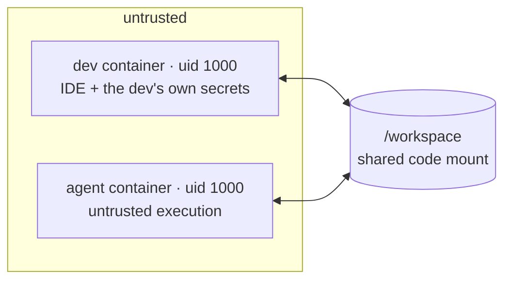

# Security Patterns & Workspace Isolation

Legend

— **implementation:** ✅ implemented · ♾️ structural (mitigated, not eliminated).

— **Mitigation (matrix, §3):** ● total prevention · ◐ partial · — not addressed by that layer.

---

## 1. Core assumption — untrusted code runs in the consumer containers

> **Code running in the workspace (dev) and agent containers is NOT trusted.**

That includes LLM agents (the original motivation) but equally: malicious or
compromised **npm/pip/cargo packages**, **VS Code extensions**, and build scripts —
any code that executes or writes files in those containers. The design does **not**
assume "the agent is well-behaved"; it assumes hostile code already runs there and
limits what that buys an attacker.

The corollary that drives everything: **within a single container, same-uid processes
have no isolation from each other** — they read each other's `/proc/<pid>/environ`,
connect to each other's unix sockets, and read/modify each other's files. So we do
**not** try to separate trusted from untrusted code _inside_ one container; we keep
anything powerful in a _different container_. **The isolation boundary is the
container — namespaces + mounts — not the uid.**

---

## 2. Adoption layers

The toolkit is adopted in **three composable layers**. Each builds on the previous;
you stop wherever your threat model and effort budget land.

### Layer 1 — Hardened single container

Use **`base`** as your devcontainer image, paired with the toolkit's hardened
`docker-compose.yml`. One container; if you run an agent it runs _alongside_ the dev,
same uid. Adds:

- **VS Code host-channel hardening** (§5) — blanks/scrubs the env channels that leak
  host credentials, and reaps the askpass/`code`-CLI IPC sockets.
- **OS-level container isolation** (§6) — `cap_drop: ALL`, `no-new-privileges`, no
  sudo, bridge networking, no Docker socket, `ptrace_scope ≥ 1`.

This is the floor: no agent isolation, no credential vending.

### Layer 2 — Isolated agent

Add a second **`agent`** container (also `base`, with its `user:` set by the runtime),
sharing **only** the `/workspace` code mount with the dev container. The dev container
keeps the IDE and the dev's secrets; the agent runs untrusted in its own namespaces and
is driven over a shared-volume `tmux` socket (§9). Adds (§8):

- The agent **cannot read the dev's at-rest secrets** (`~/.ssh`, `~/.aws`, home) —
  they're unmounted — nor scrape the dev's process memory/env (separate namespaces).

Both containers still get Layer 1 hardening + the hardened compose. It does **not**
protect against untrusted code in the _dev_ container (that's Layer 3 / discipline).

> do we have an opinion on how credentials get into the isolated agent's container? if nto, we should at least make a statement that this concern isout of scope at layer 2

### Layer 3 — Credential vending

Add a credential **sidecar** that vends short-lived, scoped, per-consumer credentials
over a socket; the powerful upstream authority never enters a consumer container.

> note that 'over a socket' is not true for all sidecar implements, since we use a 'file shelf' for the initial one

Composes with Layer 1 (a lone dev container) **or** Layer 2 (the agent too). In the
shipping baseline every consumer reads the **same** vended secrets from a read-only
`/creds` shelf; giving the agent a _narrower_ grant than the dev is the broker variant
([CREDENTIAL-BROKER.md](./CREDENTIAL-BROKER.md)). Adds (§10–§11):

- Untrusted code obtains only a **scoped ≤1h token**, never the dev's broad, long-lived
  identity.

---

## 3. Risk vectors & mitigations

Every risk vector we've considered, and which layer mitigates it — **●** total
prevention, **◐** partial, **—** not addressed by that layer. The **Residual** column
flags what's left, including the vectors **no layer fully closes**.

Two credential kinds appear below — keep them distinct: a consumer's **own at-rest
secrets** (personal keys/tokens it holds directly, e.g. an SSH signing key — risk #1)
versus **vended credentials** (the short-lived scoped tokens the sidecar provides —
risks #10–13). Isolation (L2) keeps the dev's _own_ secrets away from the agent;
vending (L3) governs the _vended_ tokens.

| #   | Risk vector                                                                                         | L1 harden | L2 isolate  | L3 vend | Residual                                                                                                                                        |
| --- | --------------------------------------------------------------------------------------------------- | :-------: | :---------: | :-----: | ----------------------------------------------------------------------------------------------------------------------------------------------- |
| 1   | Untrusted code reads a consumer's **own at-rest secrets** (e.g. the dev's `~` — _not_ vended creds) |     —     | ● _(agent)_ |    —    | deps/extensions in the _dev_ container still read the dev's own secrets — no layer stops that                                                   |
| 2   | **Cross-process scraping** (`/proc/<pid>/environ`, ptrace heap → Settings-Sync/Copilot tokens)      |     ◐     | ● _(agent)_ |    —    | L1 `ptrace_scope` blocks heap; same-uid env still readable _within_ a container                                                                 |
| 3   | **VS Code git OAuth token** via the askpass socket                                                  |     ◐     |      —      |    —    | ♾️ blanked + socket reaped (a race) — real fix: **don't authorize the git session**                                                             |
| 4   | **Other VS Code host channels** (`code` IPC, `BROWSER`, GPG agent, host gitconfig / cred-proxy)     |     ●     |      —      |    —    | —                                                                                                                                               |
| 5   | **Forwarded SSH-agent abuse** (`SSH_AUTH_SOCK`)                                                     |     ●     |      —      |    —    | —                                                                                                                                               |
| 6   | **In-container privilege escalation** (sudo / setuid / caps)                                        |     ●     |      —      |    —    | —                                                                                                                                               |
| 7   | **Host network / IPC namespace** access                                                             |     ●     |      —      |    —    | —                                                                                                                                               |
| 8   | **Docker socket → host root**                                                                       |     ●     |      —      |    —    | re-adding the socket voids every boundary                                                                                                       |
| 9   | **Extension-host RCE → host escape** (write files + window reload)                                  |     ◐     |      —      |    —    | ♾️ **not closed** — needs headless / web-client (§7)                                                                                            |
| 10  | Untrusted code obtains the **broad, long-lived identity**                                           |     —     |      —      |    ●    | without vending the dev holds real creds → full-identity loss on any dep/extension compromise                                                   |
| 11  | **Use + exfiltration of a _granted_ credential**                                                    |     —     |      —      |    ◐    | **not prevented** — accepted; scope+TTL limit damage, pair with egress allowlisting                                                             |
| 12  | **Credential theft at rest** (vended token files)                                                   |     —     |      —      |    ◐    | depends on the sidecar implementation: the **shelf** is at rest; the on-demand **broker** ([doc](./CREDENTIAL-BROKER.md)) holds nothing at rest |
| 13  | **No credential-usage audit**                                                                       |     —     |      —      |    ◐    | the **shelf** has none; the **broker** ([doc](./CREDENTIAL-BROKER.md)) adds per-request audit                                                   |
| 14  | **Shared `/workspace` poisoning** (`.git/hooks` runs as the dev)                                    |     —     |      ◐      |    —    | discipline: `core.hooksPath` for agent-touched repos (§8)                                                                                       |
| 15  | **Applying agent output in a trusted context** (your machine / CI)                                  |     —     |      —      |    —    | **not mitigated** — discipline only: review diffs first (§12)                                                                                   |
| 16  | **Over-broad credential scope**                                                                     |     —     |      —      |    ◐    | **operator's call** — vending enforces _scoped_, not _which_ scope                                                                              |
| 17  | **Host / machine compromise**                                                                       |     —     |      —      |    —    | **out of scope** — the host is the real perimeter (§4)                                                                                          |

In one line: **blast-radius reduction and discipline support — not secrecy, not a
sandbox, and not protection from a compromised host.**

> from the above table, it doesn't really look like 'L2' gives much benefit. Is that an accurate read, or is this table not conveying the real picture accurately?

---

## 4. Trust tiers — the concept

Trust is **concentric**: each tier holds only what it must, and powerful credentials
live as far from untrusted code as possible.

| Tier                                 | Holds                                                                                                                       | Trust         |
| ------------------------------------ | --------------------------------------------------------------------------------------------------------------------------- | ------------- |
| **Consumer containers** (dev, agent) | only short-lived, scoped, _vended_ credentials                                                                              | **untrusted** |
| **Credential sidecar**               | the vend machinery + whatever upstream authority it's bootstrapped with (an SSO session, a signing key, a long-lived token) | trusted       |
| **Container runtime / host**         | sets uids and namespaces — a real, root-equivalent boundary                                                                 | trusted       |

How the sidecar obtains that upstream authority, and how a human authenticates to it,
is deployment-specific and outside this general model.

The two boundaries that carry the weight: **sidecar ↔ consumer** (the credential
architecture, §10) and **consumer ↔ host** (the VS Code channel + RCE surface of a
desktop-attached dev container, §5, §7).

---

## 5. Layer 1 · VS Code host-channel hardening ✅

When a dev container is attached to VS Code, VS Code's remote model bridges many host
credentials/capabilities into it. Each is a channel untrusted code _in that container_
(an extension, a dependency's child process) could ride:

| Channel                                                                 | Exposes                                                                                             | Control                                                                                             | Status |
| ----------------------------------------------------------------------- | --------------------------------------------------------------------------------------------------- | --------------------------------------------------------------------------------------------------- | ------ |
| **git askpass / OAuth** (`GIT_ASKPASS`, `VSCODE_GIT_IPC_HANDLE` socket) | the human's VS Code GitHub **OAuth token** (`repo`+`workflow`) once the _git_ session is authorized | `git.useIntegratedAskPass:false` + `remoteEnv` blanks vars; the socket is **reaped** (below)        | ✅ ♾️  |
| **host-credential-proxy** (injected `credential.helper`)                | the host's _stored_ git creds                                                                       | `remote.containers.gitCredentialHelperConfigLocation:none`                                          | ✅     |
| **host gitconfig copy**                                                 | host `~/.gitconfig` + `.git-credentials` (plaintext token, signingkey)                              | `remote.containers.copyGitConfig:false`                                                             | ✅     |
| **`code` CLI / IPC** (`VSCODE_IPC_HOOK_CLI`, `vscode-ipc-*.sock`)       | `code` against the host — incl. `--install-extension` (RCE bootstrap), `--openExternal`             | `remoteEnv` blanks the var; socket **reaped**                                                       | ✅ ♾️  |
| **`BROWSER`**                                                           | host browser/handler launch (phishing, OAuth-redirect abuse)                                        | `remoteEnv` blanks it                                                                               | ✅     |
| **`GPG_AGENT_INFO`**                                                    | host GPG agent                                                                                      | `remoteEnv` blanks it                                                                               | ✅     |
| **SSH agent** (`SSH_AUTH_SOCK`)                                         | a forwarded host SSH agent — enumerate keys, auth elsewhere, SOCKS-pivot                            | **scrubbed by default** by `base` (`SCRUB_SSH_AUTH_SOCK_ENABLED`); a project that needs it opts out | ✅     |
| **Settings Sync / Copilot tokens**                                      | the human's token for those features                                                                | **not reachable** — client-side + in ext-host heap, `ptrace_scope≥1`                                | ✅     |

**Two-layer env neutralization (both required).** `remoteEnv` blanks the vars for
processes VS Code _spawns_ — which covers untrusted code spawned non-interactively
(an extension's child processes, a `bash -c`). But VS Code **re-injects**
`VSCODE_GIT_IPC_HANDLE`/`VSCODE_IPC_HOOK_CLI`/`BROWSER` into **integrated terminals**,
overriding `remoteEnv` there — so a **build-time shell scrub**
(`/etc/profile.d/50-scrub-vscode-git-auth.sh` + a `/etc/bash.bashrc` include, shipped
in `base`) is what cleans them, and it matters because anything launched from an
integrated terminal inherits its env. `remoteEnv` for spawned processes, the scrub for
interactive terminals — both load-bearing.

**The IPC-socket residual (♾️) + the reaper.** The git/CLI extensions stay enabled, so
VS Code keeps recreating `vscode-git-*.sock` (askpass/OAuth) and `vscode-ipc-*.sock`
(the `code` CLI). These sockets have **no caller authentication** — any same-uid
process can connect, _regardless of the blanked env var_. A container entrypoint
**reaps** them on a short interval (sparing `vscode-remote-containers-*.sock` and
`vscode-ssh-auth-*.sock`). The reaper is defense-in-depth, not a wall — recreation is a
race. The real guarantee is upstream: **do not authorize the VS Code git OAuth
session** (with no session the socket vends nothing). Settings Sync + Copilot don't
create it; only an explicit git sign-in / "Publish to GitHub" does.

**`ptrace_scope`.** Settings-Sync/Copilot tokens live in the ext-host process heap (not
on disk, not in env). They're protected from a sibling process only by yama
`ptrace_scope ≥ 1`. **Never run with `ptrace_scope=0`, `--privileged`, or
`CAP_SYS_PTRACE`** — any re-opens heap scraping.

---

## 6. Layer 1 · Container isolation (OS-level) ✅

- **Bridge networking** (no `network_mode`/`ipc: host`) — no host net/IPC namespace;
  also closes the forwarded-SSH-agent SOCKS/LAN-pivot vector.
- **`cap_drop: [ALL]` + `no-new-privileges:true` + no sudo grant** — no caps, no setuid
  escalation (which also makes sudo non-functional). Untrusted code runs as an ordinary
  unprivileged user and can't tamper with root-owned tooling.
- **No Docker socket** — a writable `docker.sock` is root-equivalent on the host and
  voids every boundary. (Container-to-container _networking_ and shared volumes remain,
  so you don't need it to drive the agent — §9.)
- Because there's no runtime sudo, all privileged setup is baked into the Dockerfile.

These live in the toolkit's hardened `docker-compose.yml`; a consuming devcontainer
inherits them by using that compose plus `base`.

---

## 7. Layer 1 · Extension-host RCE — host escape (♾️ structural, not closed)

The deepest risk this architecture **cannot fully close**: a **workspace extension**
runs in the dev container's extension host and can call host-only VS Code commands over
the client↔server RPC bridge — `workbench.action.terminal.newLocal` + `sendSequence` ⇒
**arbitrary shell on the desktop**. Untrusted code in the dev container (a malicious
extension, or a dependency's postinstall) doesn't need to _be_ an extension — it can
**write files**: poison an installed extension's JS (`~/.vscode-server/extensions/.../*.js`,
same-uid-writable) or coerce `remote.extensionKind` via the bind-mounted
`.vscode/settings.json` / `devcontainer.json`. On the next **window reload** the
poisoned code runs in the ext host with host reach, **bypassing all credential
isolation**.

It's bridge-model-inherent. Real mitigations are architectural: the **web client**
(`code serve-web`) or attaching **no trusted desktop client** at all. Until then it's documented,
not mitigated — and `.vscode`/`.devcontainer` are writable by code in the dev
container, with some settings applying on **reload**, so review their diffs before
_reloading_, not just rebuilding (§12).

---

## 8. Layer 2 · Agent isolation — separate container, same uid, mount topology

Isolate the **agent** (the loudest untrusted actor) in its own container. Dependency
installs, builds, and extensions still run in the dev container — handled by
credential scoping + discipline, not isolation (§11).



| Container | Runs                                                   | Mounts                                                                                                      |
| --------- | ------------------------------------------------------ | ----------------------------------------------------------------------------------------------------------- |
| **dev**   | IDE, shell, review, commit                             | `/workspace`, the dev's own secrets (`~/.ssh` signing key, `~/.claude`, …), `/creds` shelf (ro, if vending) |
| **agent** | tmux server + agent sessions (×N); untrusted execution | `/workspace` + `/creds` shelf (ro, if vending) **only** — none of the dev's own secrets                     |

_(Credential vending — the sidecar and `/creds` shelf — is Layer 3, §10. Layer 2 is
just these two containers sharing the `/workspace` code mount; it works with or without
vending.)_

**Why a separate container, not a second uid in one.** Two uids in one container would
need a privileged launcher to `setuid()` down — but `cap_drop: ALL` strips
**`CAP_SETUID` even from root**, so nothing inside the hardened container can switch
uid, and adding the cap back weakens the best hardening. A separate container lets the
**runtime** set `user:` at creation (outside the container's caps): no in-container
privilege, no bespoke launcher, `cap_drop: ALL` intact, and separate PID/IPC
namespaces (the agent can't see, `ptrace`, or read `/proc/environ` of the dev's
processes).

**Same uid, isolated by mounts.** Both run as uid 1000. Across containers, isolation
comes from **namespaces + mount topology**, not the uid:

> **Invariant: the agent container mounts only `/workspace` + its broker socket —
> never `~/.ssh`, `~/.aws`, `~/.claude`, or anything else.**

The dev's keys/creds/home live in the _dev_ container's fs; unmounted, they're
unreachable regardless of uid. Same-uid keeps it simple (agent-written files are
1000-owned, the dev commits cleanly — no shared-group/setgid dance). Two notes:

1. Credentials come from the shared read-only `/creds` shelf — the **same** for both
   consumers — so credential access doesn't depend on the uid. Giving the agent a
   _different_ credential policy than the dev is the broker variant
   ([CREDENTIAL-BROKER.md](./CREDENTIAL-BROKER.md)), which distinguishes consumers by
   socket, not uid.
2. The one residual: the agent can write anything in shared `/workspace`, including
   `.git/hooks/*`, which would execute **as the dev** on the dev's next git op.
   Mitigate with discipline (`git config core.hooksPath /dev/null` for agent-touched
   repos), not uid.

---

## 9. Layer 2 · Driving the agent — tmux

No Docker socket is exposed, but container-to-container networking and shared volumes
are — so the dev reaches the isolated agent without `docker exec`. Run a **tmux**
server in the agent container on a shared-volume socket; the dev attaches from any
number of terminals.

In the agent container (its entrypoint), start a server and a first session:

```sh
tmux -S /run/agent/tmux.sock new-session -d -s main claude
```

From the dev container, attach from each terminal (alias to taste):

```sh
tmux -S /run/agent/tmux.sock attach                 # attach the running session
tmux -S /run/agent/tmux.sock new-window claude      # add another agent session
tmux -S /run/agent/tmux.sock attach \; choose-tree  # pick among windows
```

- **Many sessions:** one window per `claude`; switch with the usual tmux keys.
- **Many terminals / pairing:** every terminal runs `attach`; multiple clients can view
  the same window at once. Same-uid removes tmux's cross-uid owner-check, so no
  permission workaround is needed.

**Passing args to the agent.** Whatever follows `claude` is just its command line, so
per-session flags work normally — e.g. start an isolated worktree session, or resume a
prior one:

```sh
tmux -S /run/agent/tmux.sock new-window 'claude --worktree feature-x'
tmux -S /run/agent/tmux.sock new-window 'claude --resume'
```

**Session lifecycle.** The processes run in the **tmux server inside the agent
container**, independent of any client:

- **Detach** (`Ctrl-b d`, or just close your terminal) — the `claude` process keeps
  running server-side; reattach later with `attach`.
- **Exit** — when `claude` exits (or you kill the window), that window closes and the
  process is gone. (By default tmux destroys a window when its process exits; set
  `remain-on-exit` if you want the pane to stay so you can read final output.)
- The server and all its sessions live until the agent **container** stops or you
  `tmux -S … kill-server`. Have the container entrypoint **respawn** the primary
  session so there's always one to attach to.

The agent's edits land on shared `/workspace`, so the dev reviews them live in the IDE.

---

## 10. Layer 3 · Credential vending (the shelf)

**Motivation:** the powerful credentials the sidecar holds (whatever upstream authority
it's bootstrapped with — an SSO session, a signing key, a long-lived token) must never
be reachable by untrusted code. Since same-uid offers no isolation within a container,
the durable answer is a **separate sidecar** that vends only narrow, short-lived
derivations.

**The shelf (shipping baseline).** The sidecar writes the vended credentials —
short-lived (≤1h), scoped — to a **`/creds` shelf** that every consumer mounts
**read-only**. In this baseline **all consumers read the same shelved secrets**: the
agent and the dev get identical vended creds. The consumer side reads them through the
resolver/adapters described in [SECRETS.md](./SECRETS.md).

- A consumer has **no signing capability and no upstream authority** — it can only read
  what's on the shelf; it cannot mint or widen anything.
- **What's vended is decided in the sidecar** (which roles / installations / repos /
  perms), in config **baked into the sidecar image** — a consumer can't change its
  scope.
- **Accepted residual:** a consumer fully controls the creds it can read (use + network
  exfil), and the shelf is **at rest** — readable by any process in a consumer that
  mounts it. The guarantee is _blast radius_ (scoped + ≤1h), not _secrecy_.

**Per-consumer policy (the broker variant).** Giving the agent a _narrower / audited /
shorter-TTL_ grant than the dev — and removing the at-rest exposure — is the
**broker**: a per-consumer socket backed by a per-consumer grant table. That's a
separate design, not yet the shipping baseline — see
[CREDENTIAL-BROKER.md](./CREDENTIAL-BROKER.md).

**Remote-refresh trigger (optional inbound primitive).** An SSO session lapses ~daily and,
by default, is revived only by a **host** shell (`credential-shelf refresh`). Setting
`REFRESH_LISTENER_SOCKET` binds one narrow inbound handler on a Unix socket — the sidecar's
_only_ inbound surface — that lets a network-facing peer _initiate_ the existing device-code
login remotely. It preserves the tier-3 "vend-only, no shells" invariant by construction:

- **It only initiates; it never completes a login.** AWS Identity Center (+MFA) stays the
  minter. The handler starts a device authorization, returns the `user_code` +
  `verification_uri`, and vends only after the operator approves in a browser.
- **No caller arguments.** The sso-session comes from the sidecar's own baked config, not the
  request — so the primitive can't be steered to a different IdP or coerced into minting,
  exfiltrating, or running commands. Worst case for whoever reaches the socket is a
  **login-prompt DoS, not a credential mint** (rate-limit it upstream — repeated triggers can
  hit AWS device-authorization limits and _block_ the real refresh).
- **Front it, don't expose it.** The socket must be reachable only by a **separate, minimal**
  network container (auth + rate-limit + audit; no AWS identity, no `admin-home`, no Docker
  socket) — [`credential-shelf-trigger`](../../credential-shelf-trigger). Never place the
  socket on a volume a consumer mounts.
- **Operator-initiated approval is load-bearing.** The device grant doesn't bind approver to
  initiator; surfacing the `user_code` lets the operator approve **only a code they just
  initiated** and refuse unsolicited prompts.

---

## 11. Layer 3 · Why still vend creds to the _dev_ container

The agent is isolated, but the dev container still runs untrusted code — `npm/pip
install` (postinstall scripts) and VS Code **extensions**. So isolating real creds
from it is still worth it:

- **Dev holds real creds** (`gh auth login`, `aws sso login`) → one malicious
  dep/extension exfiltrates the dev's **broad, long-lived identity** (a `repo+workflow`
  OAuth token; an SSO session that can mint any role). Catastrophic.
- **Vending** → a dep/extension gets only a **scoped ≤1h token**; the upstream
  authority stays in the sidecar, unmounted and unreachable. Small, expiring.

**Never co-locate the vending sidecar with untrusted code** — that returns the
upstream authority to within reach of the dep/extension code and defeats the boundary.
(Dropping dev-side vending is a legitimate _risk acceptance_, not a free
simplification — then add `--ignore-scripts`, vetted extensions, and an egress
allowlist.)

---

## 12. Human discipline (the patterns depend on these)

The architecture confines **credentials**; it does not stop you running code an agent
wrote or approving a prompt it induced. Those gaps are closed by you:

- **Agents prepare, humans review-and-apply.** Review diffs before running agent output
  in any trusted context, and before any hard-to-reverse / outward-facing action
  (deploy, merge, push, destroy). _(Closes nothing technically — it's the only control
  for risk #15.)_
- **Review `.devcontainer/`, `.vscode/settings.json`, `devcontainer.json` diffs before
  window _reload_ and rebuild** — they're writable by code in the dev container, and
  some apply on reload (the `remote.extensionKind` RCE path, §7).
- **Don't authorize the VS Code GitHub _git_ sign-in** ("Publish to GitHub") — it arms
  the askpass-socket leak (§5). Settings Sync + Copilot are fine.
- **Scope deliberately, least-privilege** — vend the narrowest grant a task needs (the
  _which-scope_ half of risk #16).
- **Treat everything in the consumer containers as hostile**; no production secrets in
  them.

---

## 13. What an attacker who controls a consumer container gets

- ✅ **Cannot** reach the sidecar's upstream authority or mint/widen anything — it lives
  in the sidecar.
- ✅ **Cannot** read the host's git / Settings-Sync / Copilot creds (channels blanked +
  scrubbed; tokens client-side / ptrace-protected) — for the dev container.
- ✅ **Can** use + exfiltrate the scoped ≤1h creds vended to that container (accepted;
  blast-radius-limited).
- ♾️ **Can**, _if_ the VS Code git OAuth session is authorized in the dev container,
  pull that token from the askpass socket → **don't authorize it**.
- ♾️ **Can**, from a dev container with a desktop client attached, achieve **RCE on the
  host** via the extension host by writing files + a window reload → mitigated only by
  going headless / web-client / VSCodium (§7).
- ✅ **Cannot** escalate in-container (no caps/sudo) or reach the host net/IPC namespace.

---

## 14. Invariants (don't regress these)

1. Agent container mounts **only** `/workspace` (+ the read-only `/creds` shelf, if
   vending) — none of the dev's own secrets (§8).
2. The sidecar's upstream authority is mounted into **no** consumer; its vend config is
   **baked into the image**, not bind-mounted (§10).
3. The `/creds` shelf is mounted **read-only** into consumers — they can't tamper with
   or forge vended creds (§10). _(The broker variant instead mounts one socket per
   consumer — [CREDENTIAL-BROKER.md](./CREDENTIAL-BROKER.md).)_
4. `cap_drop: ALL` + `no-new-privileges` on every consumer; uid set by runtime `user:`,
   never an in-container launcher; **never** `--privileged`, `ptrace_scope=0`,
   `CAP_SYS_PTRACE`, `network_mode/ipc: host`, or a Docker socket (§5, §6).
5. VS Code: `git.useIntegratedAskPass:false`,
   `remote.containers.gitCredentialHelperConfigLocation:none`,
   `remote.containers.copyGitConfig:false`; blank the host-channel env vars in
   `remoteEnv` **and** scrub them in interactive shells; keep the IPC-socket reaper (§5).
6. github.com credential helper routes to the vended token only; **never** configure
   `credential.helper store` (a plaintext token sink).
7. Never co-locate the vending sidecar with untrusted code (§11).

---

## 15. Sources & references

- Daniel Demmel, _Coding agents in secured VS Code dev containers_ —
  <https://www.danieldemmel.me/blog/coding-agents-in-secured-vscode-dev-containers>
  (env clearing, socket deletion, `cap_drop`/`no-new-privileges`/no-sudo).
- The Red Guild, _Leveraging VSCode internals to escape containers_ —
  <https://blog.theredguild.org/leveraging-vscode-internals-to-escape-containers/>
  (the ext-host → host RCE chain, gitconfig copy, agent-forwarding attacks).
- Cycode, _VS Code's Token Security_ — <https://cycode.com/blog/exposing-vscode-secrets/>
  (where SecretStorage persists, client-side).
- VS Code: [Remote extensions](https://code.visualstudio.com/api/advanced-topics/remote-extensions)
  (extensionKind; SecretStorage stores client-side) ·
  [Sharing Git credentials](https://code.visualstudio.com/remote/advancedcontainers/sharing-git-credentials).
- `microsoft/vscode-remote-release#4426` (why `copyGitConfig:false` is also needed) ·
  `#5500` (disabling the git helper in remote).
- `extensions/git/src/askpass.ts` — the askpass IPC server has **no caller auth**
  (trusts the uid, not the caller).
